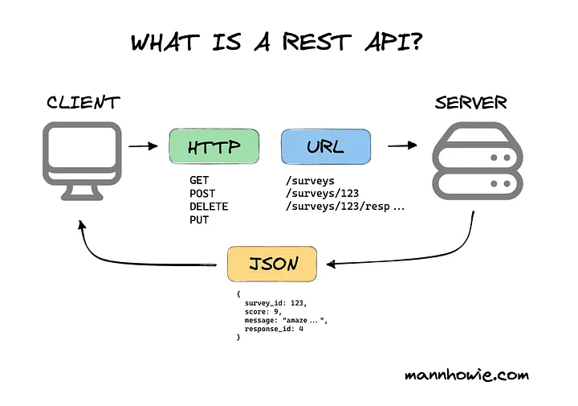

 <h1 align="center">
    Application Programming Interface
    
 </h1>

## O que é uma API?

Uma API permite que um software peça informações de outro software, sem precisar entender como ele funciona por dentro. Ela age como um "mensageiro", conectando dois sistemas diferentes.

### Exemplo 1:

Imagine que você está criando um aplicativo ou jogo de Pokémon. Em vez de criar e preencher manualmente uma tabela com informações sobre todos os Pokémons (como nome, tipo e habilidades), você pode usar a API do Pokémon. Essa API já possui todos os dados de cada Pokémon disponível, e você pode simplesmente "consultá-la" sempre que precisar de informações.

Ao fazer isso, você economiza tempo e esforço, pois não precisa construir uma base de dados do zero. A API do Pokémon cuida disso para você, fornecendo todos os detalhes que você precisa com uma simples solicitação.

<br>

### Exemplo 2:

Imagine que você está criando um aplicativo onde uma das funcionalidades é exibir a previsão do tempo. Em vez de desenvolver toda uma infraestrutura para calcular a previsão, você pode simplesmente usar a API de previsão do tempo.

Essa API já tem acesso a todos os dados meteorológicos e pode te fornecer informações como temperatura, condições climáticas e previsão para os próximos dias. Você não precisa se preocupar com o que acontece no backend dessa API, como os dados são obtidos ou processados. Tudo o que você precisa fazer é solicitar as informações e a API te envia os dados prontos para exibir no seu app.

<br>

### Exemplo 3:

Imagine que você está criando um aplicativo de entrega de comida, e uma das funcionalidades é calcular o trajeto entre o restaurante e o cliente. Em vez de construir um sistema complexo para calcular rotas, você pode usar a API de mapas, como a do Google Maps.

Essa API já sabe como calcular as melhores rotas, levando em conta o trânsito e a distância. Você só precisa enviar os endereços de partida e destino, e a API te devolve o trajeto pronto. Não é necessário entender como a API funciona por dentro; ela só te entrega as informações que você precisa para exibir no seu aplicativo.

<hr>
<br>

## O que é uma API Rest?



Uma API REST (ou API RESTful) é um tipo específico de API que segue um conjunto de regras para facilitar a comunicação entre sistemas através da web, usando o protocolo HTTP.

Essas regras seriam:

- URLs padronizadas
- Verbos HTTP
- Envia e recebe Objetos JSON

<hr>
<br>

### URLs padronizadas

Cada URL representa um recurso específico e deve seguir uma estrutura organizada. Por exemplo:

- `https://api.exemplo.com/livros`: Representa a lista de todos os usuários.
- `https://api.exemplo.com/livros/123`: Retorna o livro com #ID '123'

Essas URLs ajudam a manter a API simples e intuitiva, permitindo fácil acesso aos recursos.

<hr>
<br>

### verbos HTTP

Como dito antes, todas as rotas da nossa aplicação são criadas na Controller Class.

Os tipos de rotas/request são:


<br>

- `@GetMapping` --> Requisição para retornar um dado. `SELECT FROM`
- `@PostMapping` --> Requisição para cadastrar um dado. `INSERT INTO`
- `@PutMapping` --> Requisição para alterar um dado. `UPDATE SET`
- `@DeleteMapping`--> Requisição para deletar um dado. `DELETE FROM`

<br>

As rotas seguem o padrão no **plural**.

<hr>
<br>

### objetos .JSON

Na maioria dos casos, uma API REST recebe e envia dados no formato JSON (JavaScript Object Notation)

Um exemplo de um objeto JSON seria:

```JSON
{
    "id": 33,
    "name": "gabriel",
    "age": 55
}
```