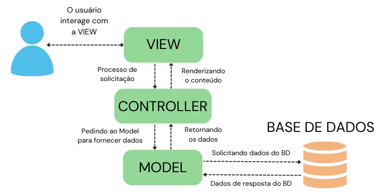

 <h1 align="center">
    MVC - Model View Controller
    
 </h1>

<!-- MVC flow -->

    

 

O padrão MVC é um padrão de arquitetura de software que divide a aplicação em 3 camadas:

1. **MODEL**
2. **VIEW**
2. **CONTROLLER**

 

## **View(visao)** 

A View é a camada responsável pela interface gráfica e interação com o usuário. É através dela que o usuário envia ou recebe dados

Ex: Página html, pagina de aplicativo, terminal/console, postman, etc...

 

## **Controller** 
Camada que cria e controla as rotas da aplicação. É aqui que recebemos a solicitacao/request do cliente **(GET / POST / PUT / DELETE**) e pedimos para a model fornecer esses dados.

 

## **Model** 
Camada que representa os dados da aplicação. É aqui que vamos pegar os dados do banco de dados.

É aqui que teremos os packages **Service** and **Repository**.

- **Model/Entity** --> Representacao em forma de Classe dos dados de um banco de dados. Onde, a Class representa uma table do banco, e os attributes representam os campos dessa table.

- **Service** --> Responsável em fazer as lógicas do negócio. Ex: Só pode cadastrar "Students" acima de 18 anos, etc... É aqui que criamos essa lógica.

- **Repository** --> Responsável em acessar o banco de dados. É aqui que fazemos nossas queries.