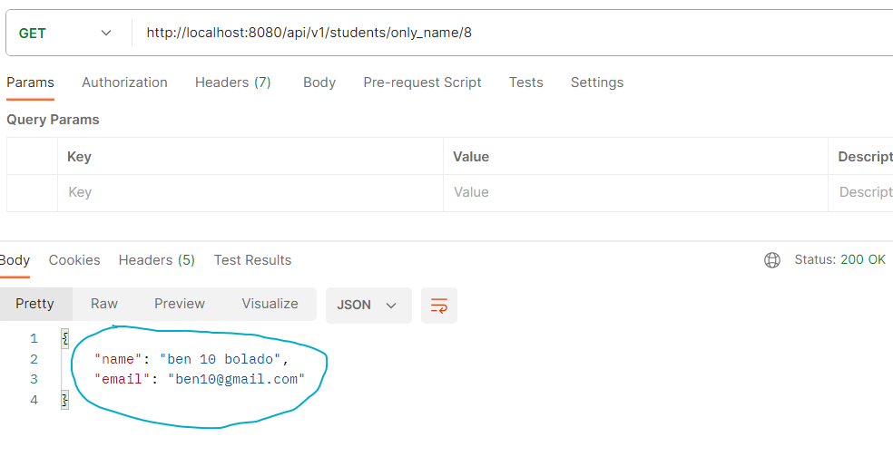

<h1 align="center">
    DTO (Data Transfer Object)
    
</h1>

DTO nada mais é do que o objeto que vamos usar para transferir dados entre camadas.

Não é interessante expor nossa **Entity/model** "Student" entre as camadas da nossa aplicação, expondo todos os seus attributes. Vão existir algumas requisições que o cliente deseja receber apenas algumas dessas informacoes/attributes.

- Ex1:

    O cliente faz uma requisiçao para receber apenas o "name" de um Student. Por que diabos vamos expor todos os attributes/informacoes da nossa Entity/model "Student".

- Ex 2:

    Imagine que determinada requisição/rota deseja apenas retornar o "name" e o "email" do "Student". Então, faz mais sentido criarmos uma "StudentDTO" com apenas esses 2 attributes.

<br>

 Para mais segurança, é melhor criarmos uma Class espelho de "Student" para aí sim enviarmos os dados.


Basicamente, vamos criar uma Class espelho de "Student", chamada "StudentDTO". Nessa class vamos deixar apenas os attributes que desejamos enviar.


Logo, podemos ter VÁRIAS "**StudentDTOs**" para enviar em diferentes tipos de requisicoes.

- "StudentDTO1"
- "StudentDTO2"
- "StudentDTO3"
-  etc...

<hr>
<br>

✏️ Crie 1 class DTO para enviar apenas o "name" e o "email"

```java
package br.com.lGabrielDev.projetinhoFelas.models.student;


public class StudentDTO1 {

    //attributes
    private String name;
    private String email;
    
    //constructors
    public StudentDTO1(){}

    public StudentDTO1(String name, String email){
        this.name = name;
        this.email = email;
    }

    //outra maneira de pegarmos as informacoes do Student, seria passar um objeto Student e copiar seus attributes. Bem nice and easy de copiar os dados.
    public StudentDTO1(Student st1){
        this.name = st1.getName();
        this.email = st1.getEmail();
    }

    //getters and setters
    public String getName() {
        return name;
    }
    public void setName(String name) {
        this.name = name;
    }
    public String getEmail() {
        return email;
    }
    public void setEmail(String email) {
        this.email = email;
    }

    //toString()
    @Override
    public String toString(){
        return
            String.format(
                "Name: %s\n" +
                "Email: %s\n", this.name, this.email
            );
    }    
}
```

Perceba que temos 2 formas de pegar as informacoes de um Student para nossa class DTO.

- Usamos os setters()
- Passamos um "Student" direto no constructor da nossa DTO.

<br>
<br>

✏️ Crie uma requisição na Controller e depois chame a Service.

```java
//CONTROLLER

//retornando apenas 1 "Student"
@GetMapping("/students/only_name/{id}")
    public StudentDTO1 getStudentApenasName(@PathVariable("id") Long id){ // vamos retornar para o cliente um StudentDTO com apenas 2 attributes
        return this.ss.getStudentApenasName(id);
}


//SERVICE
public StudentDTO1 getStudentApenasName(Long id){ //esse method retorna um "StudentDTO", ou seja, um Student com apenas 2 attributes, se ligou??
    Optional<Student> sOptional = this.sr.findById(id);

    if(sOptional.isEmpty()){
        throw new StudentNotFoundException(String.format("Student %d not found", id));
    }

    Student studentPadraozin = sOptional.get(); //student padrao. Usamos apenas para pegar dados do banco
    
    StudentDTO1 s1DTO = new StudentDTO1(); // essa eh o objeto DTO que vamos enviar. Dale!
    s1DTO.setName(studentPadraozin.getName());
    s1DTO.setEmail(studentPadraozin.getEmail());

    return s1DTO; //retornamos esse Student com apenas "name" e "email"
}
```

<br>

✏️Mande o request:



<br>
<br>

⚠️ SEMPRE que estivermos retornando ou recebendo dados (RequestBody por exemplo), precisamos usar um objeto DTO. No nosso caso, um **StudentDTO**.

❗ Nunca vamos enviar/receber um "Student". Sempre um **StudentDTO**.

📖 Dependendo da requisicao, criamos o DTO apropriado. Podendo ter VÁRIOS DTOs.