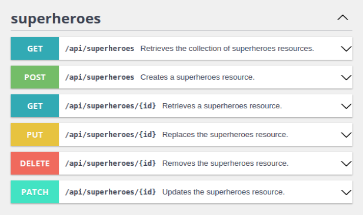

<h1 align="center">
    @Query + @Param
    
</h1>

Além de usar os methods já criados do JPA Repository, nós podemos também criar nossas próprias queries.

Tem duas formas de criar query:

1. `JPQL` --> Referenciamos pelo nome da Entity e pelos attributes
2. `Native Query` --> Referenciamos igual no sql padrao, através do nome da table e dos campos

💡 Na maioria das vezes, vamos usar o **JPQL**. Mas, se quisermos fazer queries mais complexas, com joins etc, podemos usar o native query mesmo.

<br>

Sempre que estivermos criando nossa query na mão, vamos precisar usar 2 annotations em conjunto:

`@Query` + `@Param`

- `@Query` --> Informamos a query que queremos realizar
- `@Param` --> Informamos que "tal" parametro do method vai ser mencionado na query

<br>

## @GetMapping: 
Usamos a rota `@GetMapping` quando queremos retornar dados.

`@GetMapping` --> **SELECT FROM**

Aqui, vamos criar 2 queries:

- Vamos listar todos os Students
- Vamos vamos retornar 1 student, buscando pelo #ID

<br>

Como regra, vamos seguir o padrão Restful no plural:



<hr>
<br>

### Listando todos os students - `.findAll()`

💡 Sempre que for enviar dados ou receber dados entre camadas, trabalhe sempre com objetos DTO (Data Transfer Objects).

Para praticar, vamos criar um DTO com apenas:
- id
- name
- email

<br>

#### Repository

```java
// ========== Repository ==========
@Query(nativeQuery = false, value = "SELECT s FROM Student s ORDER BY s.id DESC")
public List<Student> findAllOrderByIdDESC();
```

<br>

#### Service

```java
// ========== Service ==========
public List<StudentFullDTO> getStudents(){
    
    //pegamos a lista de students, que veio "Crua" do banco
    List<Student> studentsCrus = this.sr.findAllOrderByIdDESC();
    
    //precisamos retornar uma lista de "StudentDTOFull"
    List<StudentFullDTO> studentsDtoFull = new ArrayList<>(); //lista que vamos retornar
    
    //para cada student "cru" da lista, vamos criar um student DTO e armazenar na nossa nova lista
    studentsCrus.stream()
    .forEach(studentCru -> {
        StudentFullDTO sdf = new StudentFullDTO(studentCru);
        studentsDtoFull.add(sdf);
    });

    return studentsDtoFull;
}
```

<br>

#### Controller

```java
// ========== Controller ==========
// ============= GET =============
@GetMapping("/students")
public List<StudentFullDTO> getStudents(){
    return this.ss.getStudents();
}
```

<br>

⚠️ Perceba que criamos uma query personalizada para ordenar de forma `DESC`. Por isso, tivemos que criar um novo method.

<hr>
<br>

### Buscando Student pelo #ID - `.findById()`

O JPA já possui methods para procurar por determinados campos. Porém, é mais legal, criarmos nossa propria query.

Sempre que vamos trabalhar com findById, findByAlgumAttribute, etc, precisamos usar a Class `Optional<>`.

Essa class pode retonar null, caso não encontre nenhum registro no banco, ou retornar de fato um objeto.

Concorda que, se estamos procurando por um "Student" com tal email, pode ser que ele de fato exista, ou pode ser que não encontremos nada (null). Por isso precisamos usar a Class `Optional<>`.

<br>

#### Repository
```java
// ========== Repository ==========
@Query(nativeQuery = false, value = "SELECT s FROM Student s WHERE s.id = :id")
public Optional<Student> findById(@Param("id") Long id);
```

<br>

#### Service

```java
// ========== Service ==========
@Override
public StudentDTOFull findById(Long id){

    //verificamos se existe de fato um registor com esse #ID
    Optional<Student> sOptional = this.sr.findById(id);

    if(sOptional.isEmpty()){
        throw new StudentNotFoundException(String.format("Student #%d doesn't exists", id));
    }

    //pegamos um student "Cru" direto do banco
    Student studentCru = sOptional.get();

    //criamos um DTOzinho para enviar
    StudentDTOFull s1 = new StudentDTOFull(studentCru); //no construtor desse DTO, conseguimos copiar todos os attributes de um Student pra cá
    return s1;
}

//Outra forma de fazer, seria usando lambda 
public StudentFullDTO getStudentById(Long studentId){
    
    Student sOptional = this.sr.findById(studentId)
        .orElseThrow(() -> new StudentNotFoundException(String.format("Student #%d not found!", studentId)));

    return new StudentFullDTO(sOptional);
}
```

<br>

#### Controller

```java
// ========== Controller ==========
//Find By #ID
@GetMapping("/students/{id}")
public StudentDTOFull findById(@PathVariable(value = "id") Long id){
    return this.ss.findById(id);
}
```

💡 Perceba que nós só retornamos um Optional no repository.

💡 Perceba que nós usamos o `@PathVariable` para informar que o argumento desse parâmetro vai ser passado pela URL.

📖 Sempre que for lancar uma exception, use alguma class que extende a `RuntimeException`. Assim, não precisamos tratar com o try catch ou lancar com o throws. Podemos criar nossas proprias classes de Exception.