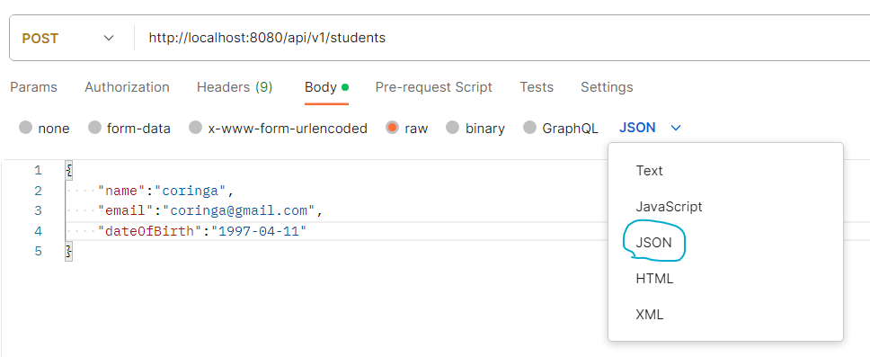

<h1 align="center">
    @PostMapping - CREATE
    
</h1>

Para criar Students no nosso banco de dados, precisamos fazer um request do tipo `@PostMapping`.

`@PostMapping` --> **INSERT INTO**

Vamos enviar esse objeto Student através do `@RequestBody`. Ou seja, vamos informar esse Student no body da requisição.

Sempre vamos seguir o padrao Restful no plural:


## Controller
Para criarmos um Student, vamos usar um "StudentDTO", removendo o campo #ID. Afinal, não precisamos informar esse campo para criar um novo registro, certo?

✏️ Crie uma Class "StudentDTOCreate".

<br>

Vamos criar a rota e o method para criar um Student

```java
@RestController //class controlador rest. É aqui que recebemos os requests http do cliente. Aqui, criamos as rotas.
@RequestMapping("/api/v1") //setamos a url padrão da API
public class StudentController {

    //attributes
    private StudentService ss;

    //constructor
    public StudentController(StudentService ss){
        this.ss = ss;
    }

    // ============= POST =============
    @PostMapping("/students")
    public ResponseEntity<StudentFullDTO> createStudent(@RequestBody StudentCreateDTO novoStudent){
        return ResponseEntity
            .status(HttpStatus.CREATED)
            .body(this.ss.createStudent(novoStudent));
    }
}
```
Vamos chamar um method da Service.

Perceba que vamos trabalhar com 2 DTOs.

- Vamos passar um "**StudentDTOCreate**" no body da requisicao. Ou seja, nao precisamos informar o "id" nem o "age". Vamos passar um Dto mais clean.
- Já no retorno do method, vamos retornar um "**StudentDTOFull**", já que queremos retornar todas as informacoes do Student.

<hr>
<br>

## Service
Vamos chamar um method da Repository. Para criar objetos no banco, usamos o method `.save()` da Repository/JPA.

Aqui não precisamos criar uma Query, pois o method `.save()` já salva no banco.

```java
@Service //essa eh uma service class. Aqui, vamos criar a lógico de negocio e validar os dados
public class StudentService {
    
    //attributes
    private StudentRepository sr;

    //constructor or @Autowired
    public StudentService(StudentRepository sr){
        this.sr = sr;
    }

    // ============= POST =============
    public StudentFullDTO createStudent(StudentCreateDTO studentDto){
        
        //name validations
        NameValidations.nameAllValidationsAreCorrect(studentDto.getName());
        
        //email validations...
        
        //birthday validations...


        Student novoStudent = new Student();
        novoStudent.setName(studentDto.getName());
        novoStudent.setEmail(studentDto.getEmail());
        novoStudent.setBirthday(studentDto.getBirthday());

        this.sr.save(novoStudent); //salvamos no banco

        return new StudentFullDTO(novoStudent);
    }
}
```

💡 Importante lembrar que o method `.save()` pode tanto criar um registro como alterar um registro.

- `.save()` --> Se você não informar o campo *#ID* ou passar um #ID que não existe, é criado um novo registro.
- `.save()` --> Se você informar um *#ID* que existe, é alterado o registro.

Entao, sempre que quisermos cadastrar um novo registro, não precisamos preencher o #ID.

<hr>
<br>

## Repository

```java
@Repository
public interface StudentRepository extends JpaRepository<Student, Long>{
    //queries

    //CREATE
}
```

📖 Não precisamos criar uma query para salvar no banco. Vamos usar o method `.save()` já criado pela JPA.

<hr>
<br>

## Criando um objeto
Vá no postman e crie um request do tipo **Post**. Lá no body do request, informe o objeto que voce deseja criar.



<br>

Dale!! 😎

<br>
<br>

Não se preocupe com as validacoes dos outros campos/attributes agora. Respira.

<br>

⚠️ Lembre-se que o que é retornado no body da requisicao é um objeto JSON. O que aparece são os methods `get()` e não o toString().