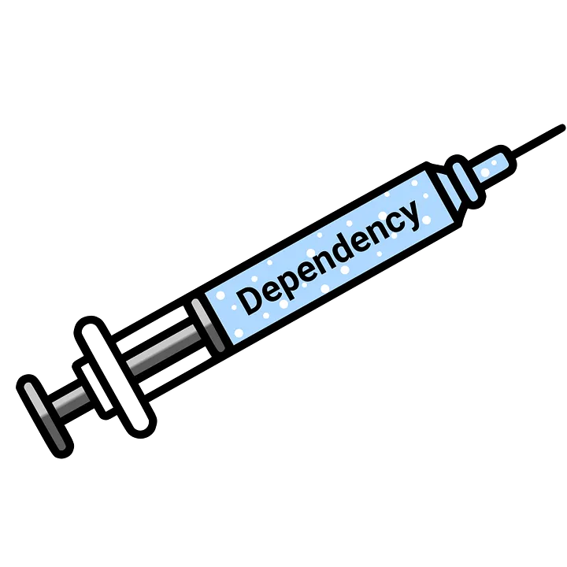

<h1 align="center">
    Dependency Injection com Spring
    
</h1>

## Injetando dependencias com Spring

Injeção de Dependência é essencial para um código flexível e fácil de testar, mas a abordagem manual pode ser repetitiva.

É aqui que o Spring Framework se destaca! Ele automatiza a Injeção de Dependência para você, gerenciando suas classes como Beans e conectando-as automaticamente.

Vamos demonstrar isso usando nosso exemplo familiar de *Computer*, *Mouse* e *Keyboard*

<br>

```java
@Component
public class Mouse {

    //attributes
    private final String brand = "logitech";
   
    //getters and setters
     public String getBrand() {
        return brand;
    }
}
```

<br>

```java
@Component
public class Keyboard {

    //attributes
    private final String brand = "Redragon";
   
    //getters and setters
     public String getBrand() {
        return brand;
    }   
}
```


O conceito de injeção de dependência é o mesmo em qualquer contexto. No Spring, as dependências são injetadas de forma automática. As duas formas mais usadas para fazer isso são:

<hr>
<br>

### Injeção via Atributo (Field Injection):

- Você coloca @Autowired direto no atributo (campo) da sua classe.

<br>

- O Spring injeta a dependência diretamente nesse atributo, sem usar um construtor para isso. É mais conciso visualmente, mas menos recomendado para a maioria dos casos por dificultar testes unitários

<br>

```java
@Component
public class Computer {

    //attributes
    @Autowired
    private Mouse mouseInsano;
    
    @Autowired
    private Keyboard tecladoInsano;

    //constructors 
    // public Computer(Mouse mouseInsano, Keyboard tecladoInsano){
    //     this.mouseInsano = mouseInsano;
    //     this.tecladoInsano = tecladoInsano;
    // }

    //getters and setters...
    public void getBrands(){
        System.out.println(this.mouseInsano.getBrand());
        System.out.println(this.tecladoInsano.getBrand());
    }
}
```

<br>

```java
@SpringBootApplication
public class IocSpringApplication {

	public static void main(String[] args) {
		ApplicationContext apcInsano = SpringApplication.run(IocSpringApplication.class, args);

		//pegando apenas 1 bean específico
        apcInsano.getBean(Computer.class).getBrands();

	}
}
```

<hr>
<br>

### Injeção via Construtor:

Esta é a maneira tradicional de injetar dependências que já conhecemos. No Spring, as dependências são injetadas via construtor, mas o preenchimento dessas dependências é feito automaticamente. Afinal, essas dependências são Beans (classes anotadas com @Component ou equivalentes), e o Spring é quem gerencia a instanciação e a injeção.


```java
@Component
public class Computer {

    //attributes
    private Mouse mouseInsano;
    private Keyboard tecladoInsano;

    //constructors --> O Spring preenche esses argumentos de forma automática
    public Computer(Mouse mouseInsano, Keyboard tecladoInsano){
        this.mouseInsano = mouseInsano;
        this.tecladoInsano = tecladoInsano;
    }

    //getters and setters...
    public void getBrands(){
        System.out.println(this.mouseInsano.getBrand());
        System.out.println(this.tecladoInsano.getBrand());
    }
}
```


<br>

```java
@SpringBootApplication
public class IocSpringApplication {

	public static void main(String[] args) {
		ApplicationContext apcInsano = SpringApplication.run(IocSpringApplication.class, args);

		//pegando apenas 1 bean específico
        apcInsano.getBean(Computer.class).getBrands();

	}
}
```

