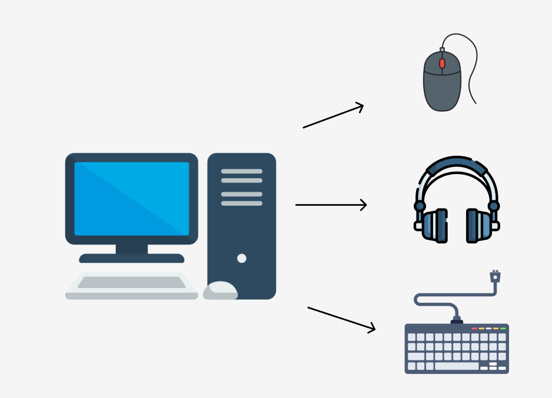

<h1 align="center">
    Dependency Injection
    
</h1>

## O que são Dependências?

Na programação, uma classe frequentemente precisa de outras classes para funcionar corretamente. Por exemplo, um Computador pode precisar de um Mouse e de um Teclado. Nesse caso 'Mouse' e 'Teclado' são **dependências** da class Computer.

Ou seja, a class Computer vai utilizar methods e/ou attributes de suas dependencias.




<hr>
<br>

### Trabalhando com dependencias da forma errada 

Da forma errada, a propria classe instancia/cria as dependencias que ela precisa.

<br>

#### Dependency 1 (Mouse)
```java
public class Mouse {
    
    //attributes
    private final String brand = "Logitech";

    //getters and setters
    public String getBrand() {
        return brand;
    }
}
```

<br>

#### Dependency 2 (Keyboard)
```java
public class Keyboard {

      //attributes
      private final String brand = "Redragon";

      //getters and setters
      public String getBrand() {
          return brand;
      }
}
```

<br>

#### Classe que vai precisar dessas dependencies

```java
public class Computer {
    
    //attributes
    private Mouse mouse = new Mouse();
    private Keyboard keyboard = new Keyboard();

    //constructors
    
    //method para testar
    public void printarMarcasPerifericos(){
        System.out.println(this.mouse.getBrand());
        System.out.println(this.keyboard.getBrand());
    }
}

```

Ou

```java
public class Computer {
    
    //attributes
    private Mouse mouse;
    private Keyboard keyboard;

    //constructors
    public Computer(){
        this.mouse = new Mouse();
        this.keyboard = new Keyboard();
    }

    //method para testar
    public void printarMarcasPerifericos(){
        System.out.println(this.mouse.getBrand());
        System.out.println(this.keyboard.getBrand());
    }
}
```

📖 Relembrando que para conseguirmos utilizar methods ou attributes de uma Class, precisamos instanciar essa Class primeiro.

Conseguimos instanciar direto no attribute ou no constructor.


<br>

#### Main method
```java
public class App{
    public static void main(String[] args){
        
        Computer c1 = new Computer();

        c1.printarMarcasPerifericos();
    }
}
```

⚠️ Se você não instanciar as dependências, você receberia um Null Pointer Exception. Precisamos instanciar de alguma forma, seja direto no atributo ou no construtor


<br>
<br>

#### Por quê instanciar as dependencias na propria Classe é errado?


Quando a classe Computer cria diretamente suas dependências (Mouse, Keyboard), ela fica **fortemente acoplada** a elas. Isso gera dois problemas principais:

<br>

- **Rigidez a Mudanças**: A classe Computer não consegue aceitar mudanças facilmente. Por exemplo, se você quiser usar um MouseGamer, será obrigado a modificar o código da Computer para aceitar essa nova versão do mouse.

    ```java
    public class MouseGamer extends Mouse{}

    public class Computer {
        
        //attributes
        private Mouse mouse = new MouseGamer(); // PERCEBE? Mesmo alterando apenas a depdendencia 'Mouse', precisamos alterar a Class 'Computer' também
        private Keyboard keyboard = new Keyboard();

    
        //constructors
        // public Computer(){
        //     this.mouse = new Mouse();
        //     this.keyboard = new Keyboard();
        // }

        //method para testar
        public void printarMarcasPerifericos(){
            System.out.println(this.mouse.getBrand());
            System.out.println(this.keyboard.getBrand());
        }
    }
    ```

<br>

- **Testes Difíceis**: É complicado testar a Computer sozinha. Como ela cria suas dependências, você não consegue mockar (simular) o Mouse ou o Teclado para testar apenas a lógica da Computer de forma isolada.

<br>

📖 O correto seria... sempre que eu alterar as dependências, a classe que as usa permanece igual.


<hr>
<br>

### Trabalhando com dependencias da forma correta (Injetando essas dependencies no constructor)


Nessa abordagem, a classe "Computer" não cria suas dependências. Em vez disso, **ela as recebe como argumentos no seu construtor**. Isso significa que quem estiver criando um Computer é quem precisa "passar" o Mouse e o Keyboard necessários.


```java
public class Computer {
    
    //attributes
    private Mouse mouse;
    private Keyboard keyboard;

   
    //constructors
    public Computer(Mouse mouse, Keyboard keyboard){
        this.mouse = mouse;
        this.keyboard = keyboard;
    }

    //method para testar
    public void printarMarcasPerifericos(){
        System.out.println(this.mouse.getBrand());
        System.out.println(this.keyboard.getBrand());
    }
}
```

Perceba que não instanciamos as dependencies na Class que vai usá-las.

<br>

```java
public class App{
    public static void main(String[] args){
        
        Mouse m1 = new Mouse(); //or Mouse m1 = new MouseGamer(); //or
        Keyboard k1 = new Keyboard();

        Computer c1 = new Computer(m1, k1);

        c1.printarMarcasPerifericos();
    }
}
```

Assim, se alterarmos o tipo da dependency, "MouseGamer", a Class "Computer" não precisa ser alterada também.

<br>
<hr>

###  Resumindo


Injeção de Dependência é fornecer as dependências de uma classe de fora, em vez de criá-las internamente.

Nada mais é do que desacoplar as classes, ou seja, deixar suas classes menos "grudadas" umas nas outras.

Em vez de uma classe se preocupar em criar as dependências que ela usa (tipo o Computer criando o Mouse), ela simplesmente recebe essas dependências prontas de fora através do construtor. Dessa forma, se você precisar mudar uma dependência (como trocar o mouse por um gamer), a classe que a usa (o Computer) nem precisa saber disso, mantendo seu código muito mais flexível.
