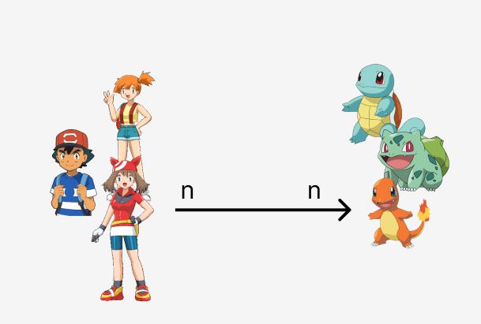
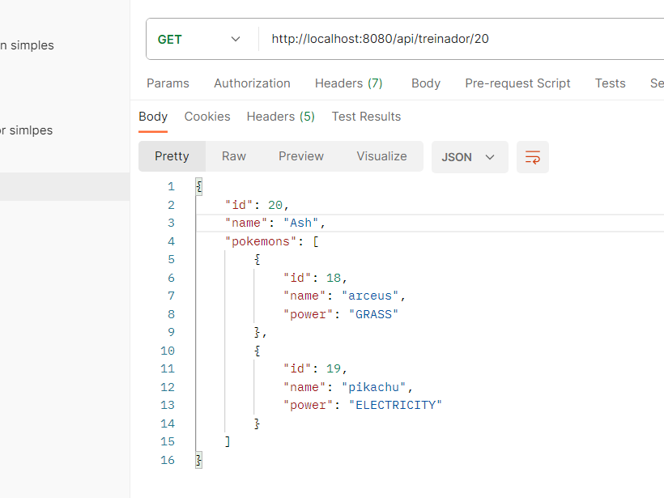
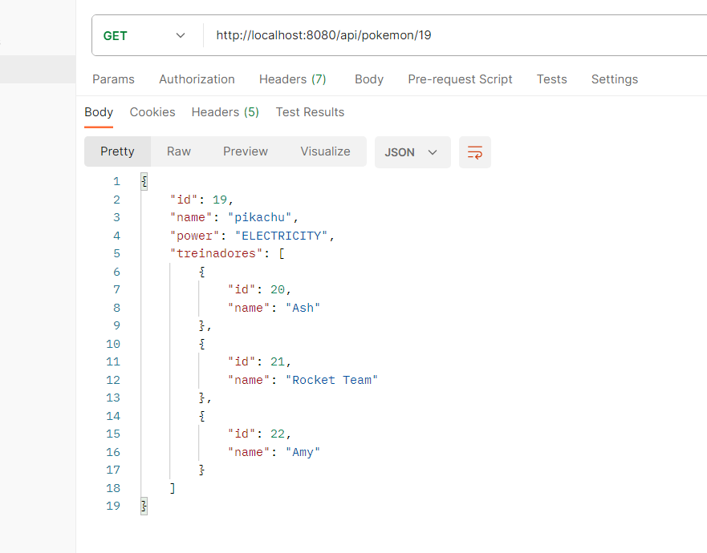

<h1 align="center">@ManytoMany</h1>
 

Aqui, vários treinadores podem ter vários pokemons. Vários pokemons podem ter varios treinadores.




Quando temos uma relação de **Many to Many** (ninguem é de ninguem). Nós sempre vamos ter 3 tables:

- **table A** --> table pokemon
- **table B** --> table treinador
- **association table** --> Aqui que vamos colocar as foreign keys. Essa e a table para fazermos as queries e pegarmos as informacoes.


💡 Nós não precisamos criar a association table na mão. O Spring automaticamente cria essa table no banco de dados pra nós. Então, nós só vamos precisar criar as 2 entidades padraozin mesmo.

<br>
<br>

### Criando as entities/tables/models

#### entity "treinador"

- **É aqui que vamos criar essa relação** @ManyToMany. 
- É aqui que vamos criar a **association table**.
- Como foi essa entidade que criou a "association table", é aqui que vamos conseguir inserir rows nessa table auxiliar.

```java
@Entity//transformamos essa Class em uma Entity no banco
@Table(name = "tb_treinador") //setamos o nome dessa table 
public class Treinador {
    
    //attributes
    @Id //esse e o campo PRIMARY KEY
    @GeneratedValue(strategy = GenerationType.IDENTITY) //auto_increment
    @Column(name = "id") //configuramos o campo
    private Long id;

    @Column(name = "name", length = 50)
    private String name;


    @ManyToMany(targetEntity = Pokemon.class) //informamos a entity B que queremos fazer relação
    @JoinTable( //criamos uma association table para conseguir relacionar essas 2 entidades. 
        name = "treinador_pokemon", //setamos o nome dessa nova table
        joinColumns = @JoinColumn(name = "treinador_id"), //Criamos o primeiro campo dessa table, que sera a PK da entity A
        inverseJoinColumns = @JoinColumn(name = "pokemon_id") //Criamos o segundo campo dessa table, que sera a PK da entity B
    )
    private Set<Pokemon> pokemons; //esse é o attribute que vamos usar para relacionar as 2 entidades. Usamos 'Set<>' porque nós NÃO QUEREMOS pokemons iguais nessa lista. 1 treinador pode ter VÁRIOS pokemons, porem eles nao se repetem.


    //constructors
    public Treinador(){}
    
    public Treinador(String name){ //usaremos para criar um treinador, sem precisar passar uma lista de pokemons
        this.name = name;
        this.pokemons = new HashSet<>(); //inicializamos essa lista para nao ter problema.
    }

    public Treinador(String name, HashSet<Pokemon> pokemons){  //usaremos para criar um treinador, que já possua pokemons 
        this.name = name;
        this.pokemons = pokemons;
    }


    //getters and setters
    public Long getId() {
        return id;
    }

    public String getName() {
        return name;
    }

    public void setName(String name) {
        this.name = name;
    }

    public Set<Pokemon> getPokemons() {
        return pokemons;
    }

    public void setPokemons(Set<Pokemon> pokemons) {
        this.pokemons = pokemons;
    }

    

    //toString() 
    @Override
    public String toString(){
        return
            String.format(
                "#ID: %d\n" + 
                "Name: %s\n", this.id, this.name  //NAO MISTURE AS COISAS. SE QUISER RETORNAR A LISTA DE POKEMONS DESSE TREINADOR, CRIE UM METHOD PARA ISSO. Só vamos mostrar os attributes que NÃO TEM RELAÇAO com outras entidades.
            );
    }
}
```

⚠️ Importante colocar o attribute que vai fazer relação como `Set<>`. Isso garante que nao seja possivel ter pokemons iguais nessa lista. Nos dois lados da relação manyToMany, precisamos criar `Set<>`. Assim, garantimo que a primary key dessa "association table" seja a combinacao dos 2 campos.

<br>
<br>

#### entity "pokemon"
- É aqui que vamos mapear/confirmar essa relação. Vamos informar qual foi o attribute da TABLE A que estabeleceu a relação.

```java
@Entity
@Table(name = "tb_pokemon")
public class Pokemon {
    
    //attributes

    @Id //esse e o campo PRIMARY KEY
    @GeneratedValue(strategy = GenerationType.IDENTITY) //auto_increment
    @Column(name = "id") //configuramos o campo
    private Long id;

    @Column(name = "name", length = 50)
    private String name;

    @Column(name = "power", length = 50)
    @Enumerated(EnumType.STRING) //informamos que esse campo é um "ENUM".Assim, conseguimos converter para String no banco
    private PokemonPower power;


    @ManyToMany(mappedBy = "pokemons") //confirmamos a relação, informando o campo da entidade A que iniciou essa relacao.
    private Set<Treinador> treinadores;


    //constructors
    public Pokemon(){}

    public Pokemon(String name, PokemonPower power){ //usaremos para criar um pokemon, sem precisar passar uma lista de treinadores
        this.name = name;
        this.power = power;
        this.treinadores = new HashSet<>(); //inicializamos essa lista para nao ter problema.
    }

    public Pokemon(String name, PokemonPower power, HashSet<Treinador> treinadores){ //usaremos para criar um pokemon, sem precisar passar uma lista de treinadores
        this.name = name;
        this.power = power;
        this.treinadores = treinadores;
    }


    //getters and setters
    public Long getId() {
        return id;
    }

    public String getName() {
        return name;
    }

    public void setName(String name) {
        this.name = name;
    }

    public PokemonPower getPower() {
        return power;
    }

    public void setPower(PokemonPower power) {
        this.power = power;
    }

    public Set<Treinador> getTreinadores() {
        return treinadores;
    }

    public void setTreinadores(Set<Treinador> treinadores) {
        this.treinadores = treinadores;
    }


    //toString()
    @Override
    public String toString(){
        return
            String.format(
                "#ID: %d\n" + 
                "#Name: %s\n" + 
                "Power: %s\n", this.id, this.name,this.power  //NAO MISTURE AS COISAS. SE QUISER RETORNAR A LISTA DE POKEMONS DESSE TREINADOR, CRIE UM METHOD PARA ISSO. Só vamos mostrar os attributes que NÃO TEM RELAÇAO com outras entidades.
            );
    }

}
```

- ⚠️ O attribute que tem relação, PRECISA SER `SET<>`. Assim, garantimo que o "pikachu" nao tera treinadores repetidos.

- ⚠️ Ao mesmo tempo, use a annotation `@JsonIgnore` para evitar erro de JSON.

<br>


Se ligou??? Sempre que quisermos relacionar 2 entities, precisamos criar 1 attribute extra em cada entity. É através desse campo que conseguimos relacionar essas entidades.

Aí vai depender do tipo da relação...

- Se um treinador pode ter varios pokemons, criamos uma **List/Set de pokemons**
- Se um treinador pode ter apenas 1 pokemon, criamos um Objeto Pokemon.

<br>

- **Muitos** --> Criamos uma lista
- **One** --> Criamos um objeto apenas

<br>

⚠️ Importante lembrar também que se nós não inicializarmos o attribute `Set<>`, não vamos conseguir adicionar items nessa lista. Por isso é importante inicializarmos essa lista em todos os constructors.

<br>


⚠️ RESPIRA! Existem várias formas de cadastrar/listar/editar/deletar os treinadores e pokemons. Veremos isso no final. Primeiro, apenas aprenda a como relacionar as entidades, nas suas 3 formas. Depois, faremos uma API, utilizando de uma dessas relações.

<hr>
<br>

### Criando alguns registros e depois relacionando
Aqui, a relação manyToMany funciona da mesma forma. *Como que voce vai adicionar dados na tabela auxiliar, se esses dados ainda nao existen??*

**Table auxiliar**

| treinador_id(FK) | pokemon_id(FK) |
| :---:            | :---:          |
| Ash              | Pikachu        |


Se ainda não existe um "Ash" no banco de dados e um "Pikachu", como voce vai preencher essa tabela?? Vai ser gerado uma Exception.

Por isso, precisamos primeiro criar esses dados, treinador e pokemon, e DEPOIS criamos essa relação, preenchendo essa tablea auxiliar.


Igual quando criamos uma relação ManyToMany no SQL PURO... Nao tem como voce colocar dados na table associativa, sem antes ter criado o "treinador" e depois o "pokemon". **Primeiro criamos os dados e depois relacionamos.**


<hr>
<br>

#### Criando treinadores e pokemons
Para criar dados, vai funcionar igualzinho qualquer outra entidade. Vamos criar o objeto, PORÉM.... NÃO VAMOS MEXER COM O ATTRIBUTE QUE FAZ A RELEÇÃO ENTRE AS 2 ENTIDADEs.

💡 Não fique bitolado em tratar todas as RuntimeExceptions. Crie apenas os treinadores e pokemons da forma mais simples possível


✏️ Crie 2 treinadores

```java
//CONTROLLER
@PostMapping("/treinador")
public TreinadorDTOFull createTreinador(@RequestBody TreinadorDTOCreateOnlyName novoTreinador){
    return this.ts.createTreinador(novoTreinador);
}


//SERVICE
public TreinadorDTOFull createTreinador(TreinadorDTOCreateOnlyName novoTreinador){
    //se nao for informado o campo 'Name' nao permitimos o cadastro
    if(novoTreinador.getName() == null){
        throw new RuntimeException("PREENCHA O CAMPO 'NAME'"); //depois lancamos um erro melhor
    }


    //criamos um "treinador Cru" para salvarmos no banco
    Treinador treinadorCru = new Treinador();
    treinadorCru.setName(novoTreinador.getName());
    this.tr.save(treinadorCru);

    //criamos um DTOzinho para retornar todos os attributes desse treinador
    TreinadorDTOFull tdfull = new TreinadorDTOFull(treinadorCru);
    return tdfull;
}
```

Perceba que, nós só passamos os attributes normais do "treinador". Não informamos o #ID nem a lista de pokemons. Como nao passamos #ID, o `.save()` cadastrou no banco.

<br>

✏️ Crie 2 pokemons

```java
public PokemonDTOFull createPokemon(PokemonDTOCreate pokemonRecebido) {

    //faremos as verificacoes:
    /*
        * - Campo "name" nao pode ser null
        * - Campo "power" nao pode ser null
        *      - Campo "power" só podera receber os "powers" existentes no enum: ['grass', 'electricity', 'fire', 'water'] VAMOS TRATAR PELO EXCEPTION HANDLER
        */
    if(pokemonRecebido.getName() == null){
        throw new RuntimeException("O campo NAME precisa ser informado");//depois usamos uma exception propria melhor
    }
    if(pokemonRecebido.getPower() == null){
        throw new RuntimeException("O campo POWER precisa ser informado");//depois usamos uma exception propria melhor
    }

    
    //verificamos seo "power" está correto:  ['grass', 'electricity', 'fire', 'water']
    if(!(MethodsLegais.powerIsCorrect(pokemonRecebido.getPower()))){
        throw new RuntimeException("Informe um 'power' correto: ['grass', 'electricity', 'fire', 'water'] ");
    }


    //tudo certinho?? Cadastramos esse pokemon no banco
    Pokemon pokemonCru = new Pokemon();
    pokemonCru.setName(pokemonRecebido.getName());
    
    //dependendo do "power" informado, setamos o power ideal
    if(pokemonRecebido.getPower().toLowerCase().equals("electricity"))
    pokemonCru.setPower(PokemonPower.ELECTRICITY);

    if(pokemonRecebido.getPower().toLowerCase().equals("fire"))
    pokemonCru.setPower(PokemonPower.FIRE);

    if(pokemonRecebido.getPower().toLowerCase().equals("water"))
    pokemonCru.setPower(PokemonPower.WATER);

    if(pokemonRecebido.getPower().toLowerCase().equals("grass"))
    pokemonCru.setPower(PokemonPower.GRASS);

    this.pr.save(pokemonCru); //salvamos no banco
    
    //criamos um DTOzinho full, para retornar um pokemon com todos os attributes 
    PokemonDTOFull pokemonDtoFull = new PokemonDTOFull(pokemonCru);

    return pokemonDtoFull;
} 
```

Deu tudo certo, pois não mexemos com o attribute que faz conexao. Primeiro, apenas criamos o treinador e o pokemon e só depois fazemos a relação, preenchendo a table auxiliar.


<br>
<br>


#### association table

Essa é a table que vamos usar para relacionar essas 2 tables (**tb_treinador** e **tb_pokemon**). Com ela, conseguimos responder:
- Tal pokemon foi escolhido por quantos treinadores?
- Tal treinador tem quantos pokemons?

Quando estamos trabalhando com uma relação **Many-to-Many**, nós criamos uma **association table**. Essa association table possui apenas 2 campos:

- **Campo1** --> Foreign key fazendo referencia a tableA
- **Campo2** --> Foreign key fazendo referencia a tableB

⚠️ Essa **association table** NÃO precisa ter um campo com primary key. Esses dois campos bastam. A primary key dessa table será a combinação desses 2 campos. Assim, não poderá ser inserido uma combinacao desses 2 campos iguais. Ex:

Se voce colocar "ashe" + "picachu".... Nao dá pra colocar esses 2 campos juntos novamente. 

A primary key faz com que um campo seja unico. Quando colocamos 2 campos na primary key, estamos dizendo que nao vai existir uma combinacao igual desses 2 campos, sacou?

<br>


Agora sim, depois de criarmos esses caras no banco, conseguimos relacioná-los.
Se fossemos usar SQL puro raiz, nós criaríamos uma row na table auxiliar, preenchendo com #treinador_id e #pokemon_id.

Aqui, vai funcionar igual. Porém, nós fazemos isso utilizando o attribute que eles tem relação. Ou seja, para acessar a 3º table/table auxiliar, nós fazemos isso atraves do campo que tem relação.


⚠️ Nós acessamos a table auxiliar, para cadastrar novos registros, ATRAVÉS DA ENTIDADE QUE CRIAMOS A TABLE AUXILIAR (`@JoinTable`). 

Nesse caso, a entidade que vai ser responsável em criar registros na table auxiliar será a entidade "Treinador", através do seu method .`getPokemons.add()`.

- ash.`getPokemons()` --> Acessamos a table auxiliar.
- ash.`getPokemons().add(pikachu)` --> Estamos acessando a table auxiliar, onde o primeiro lado da relacao é o "#ID referente ao Ash" e o segundo lado da relacao é o "#ID referente ao pikachu".


Como estamos acessando a tabela auxiilar diretamente por um registro único, o jpa automaticamente identifica o primeiro lado da relação.


<br>

❗ NÃO É POSSÍVEL CADASTRAR REGISTROS NA TABLE AUXILIAR pela Entidade que apenas referencia a relação. Nós só podemos cadastrar registros na table auxiliar através da entidade que criou essa table auxiliar, utilizando o `@JoinTable`.

<br>

✏️ Adicione os 2 pokemons ao treinador "Ash".

Nós acessamos a table auxiliar sempre pela entidade que a criou (`@JoinTable`)

```java
// =============================== Adicionar Pokemons ===============================
@Override
public TreinadorDTOFull addPokemons(Long treinadorId, List<Long> pokemonsIds) {

    System.out.println("\n\n\n\n=================================\n");
    System.out.println("Treinador #ID: " + treinadorId);
    System.out.println("Pokemon #Ids: " + pokemonsIds.toString());
    
    //verificamos se o #ID do treinador existe no banco
    Optional<Treinador> tOptional = this.tr.findById(treinadorId);

    if(tOptional.isEmpty()){
        throw new RuntimeException(String.format("Treinador #%d não existe no banco",treinadorId));
    }
    //Se o teinador existir, resgatamos esse treinador do banco
    Treinador treinadorCru = tOptional.get();

    //verificamos se os pokemons informados existem no banco. Se 1 deles nao existir, o treinador nao recebe nenhum pokemon
    for(Long i : pokemonsIds){

        Optional<Pokemon> pOptional = this.pr.findById(i);
        if(pOptional.isEmpty()){
            throw new RuntimeException(String.format("Não foi possível cadastrar os pokemons, pois o Pokemon '#%d' não existe no banco", i));
        }
        //se nao tiver sido lancado o erro acima, quer dizer que todos os pokemon #Ids informados, existem no banco
    }


    //TUDO CERTO... O treinador existe E os pokemons tambem existem. 
    //Agora, precisamos verificar se o treinador já possui algum dos pokemons informados.
    for(Long j : pokemonsIds){
        Optional<Pokemon> pOptional = this.pr.findById(j);
        Pokemon pokemonCru = pOptional.get();

        if(treinadorCru.getPokemons().contains(pokemonCru)){
            throw new RuntimeException(String.format("O treinador já possui o pokemon #%d.", j));
        }
    }

    //TUDO CERTO....
    /*
        * Treinador existe no banco...
        * Pokemons eixstem no banco...
        * Treinador nao possui nenhum desses pokemons...
        * 
        */

    //Agora, é só fazer o relacionamento bidimensional
    //   Adicionamos esses pokemons ao treinador
    //   Adicionamos esse treinador em todos esses pokemons
    
    for(Long i : pokemonsIds){
        Optional<Pokemon> pOptional = this.pr.findById(i);
        Pokemon pokemonCru = pOptional.get(); //sabemos que esse pokemon existe no banco

        //verificamos se determinado pokemon já existe na lista desse treinador
        
        
        //tudo ok, o treinador nao possui nenhum dos pokemons informados

        treinadorCru.getPokemons().add(pokemonCru); //Adicionamos o pokemon ao treinador
        pokemonCru.getTreinadores().add(treinadorCru); //Ao mesmo tempo, adicionamos esse treinador a esse pokemon

        this.pr.save(pokemonCru); // Atualizamos esse pokemon, que recebeu um treinador
    }
    //depois de adicionar todos os pokemons no treinador, salvamos no banco esse treinador
    this.tr.save(treinadorCru); // Atualizamos esse treinador, que recebeu pokemons
    


    //criamos um DTOFULL para retornar todos os attributes desse Treinador, inclusive os pokemons que foram adicionados
    TreinadorDTOFull treinadordtozinhoFull = new TreinadorDTOFull(treinadorCru);
    return treinadordtozinhoFull;

}
```

DALE! Ao mesmo tempo que adicionamos um "pokemon" na lista de pokemons desse treinador, criamos um registro na table auxiliar.

Porém... Se voce tentar registrar esses dados novamente, vai registrar com duplicidade. 

- "#ID_ash" + "#ID_charmander"
- "#ID_ash" + "#ID_charmander"

Se eu disse que o "Ash" tem o "charmander", pq vou dizer novamente isso?? Não pode.
A table auxiliar possui registros, onde a combinacao dos 2 campos DEVE ser um registro único.

Para resolver isso, é só alterar a List, do attribute que tem relação , para `Set<>`, onde nao permite valores dupliados.

Ex:

O treinador  "tal" pode ter vários pokemons, desde que eles nao se repitam.
O pokemon "tal" pode ter vários treinadores, desde que eles nao se repitam.


⚠️ Ao mesmo tempo, use a annotation `@JsonIgnore` na entidade que mapeia, para evitar erro de JSON.


<hr>
<br>


#### Relacionando

Vamos criar rotas Get para trazer as seguintes informacoes:

- Buscar um treinador pelo #ID, mostrando todas os seus attributes, inclusive seus pokemons.





<br>
<br>


```java
//CONTROLLER
//Find By #ID
@GetMapping("/treinador/{id}")
public TreinadorDTOFull getTreinador(@PathVariable(value = "id") Long id){
    return this.ts.getTreinador(id);
}


//SERVICE
@Override
public TreinadorDTOFull getTreinador(Long treinadorId) {
    Optional<Treinador> tOptional = this.tr.findById(treinadorId);
    
    if(tOptional.isEmpty()){
        throw new RuntimeException(String.format("Treinador #%d não existe no banco", treinadorId));
    }

    Treinador treinadorCru = tOptional.get();

    return new TreinadorDTOFull(treinadorCru);
    
}
```
Como antes nós tinhamos salvado os pokemons na lista desse treinador, é só usar o attribute `getPokemons()` do proprio treinador. Easy!


<br>
<br>


- Buscar um pokemon pelo #ID, mostrando todos os seus attributes, inclusive seus treinadores.




<br>
<br>


```java
//CONTROLLER
@GetMapping("/pokemon/{id}")
public PokemonDTOFull getPokemon(@PathVariable(value = "id") Long id){
    return this.ps.getPokemon(id);
}


//SERVICE
@Override
public PokemonDTOFull getPokemon(Long id) {

    Optional<Pokemon> pOptional = this.pr.findById(id);

    if(pOptional.isEmpty()){
        throw new RuntimeException(String.format("Pokemon #%d não existe.", id));
    }

    Pokemon p1 = pOptional.get();


    //retornamos um DTozinho completinho com todos os attributes desse pokemon
    return new PokemonDTOFull(p1);
}   
```
Aqui é a mesma coisa. Como tinhámos adicionado os treinadores na lista desses pokemons, é só usar o `getTreinadores()`.

Pronto! Relacionamos as entidades. 😎

<hr>
<br>


#### Criando rotas para listar All

✏️ Crie 1 rota para listar todos os treinadores e 1 rota para listar todos os pokemons

- Listar todos os treinadores, mostrando quantos pokemons esse treinador possui
- Listar todos os pokemons, mostrando quantos treinadores esse pokemon possui

Crie um DTOzinho, retirando o attribute lista e colocando um attribute para representar a **quantidadeDePokemons** / **quantidadeDeTreinadores**

<br>

- Listar treinadores

```java
//CONTROLLER
@GetMapping("/treinador")
public List<TreinadorDTOQuantidadePokemons> getTreinadores(){
    return this.ts.getTreinadores();
}


//SERVICE
@Override
public List<TreinadorDTOQuantidadePokemons> getTreinadores() {
    
List<Treinador> treinadoresCrus = this.tr.findAll();

TreinadorDTOQuantidadePokemons tQuatPokemons = new TreinadorDTOQuantidadePokemons();
return tQuatPokemons.converterTreinadores(treinadoresCrus);
    
}
```

<br>
<br>

- Listar treinadores

```java
//DTO Class, sem a lista de treinadores, mas com  a "quantidade de treinadores"

//conveter uma lista de pokemons para uma lista de "PokemonDTOQuantidadeTreiadores"
public static List<PokemonDTOQuantidadeTreiadores> converterPokemons(List<Pokemon> pokemonsCrus){

    List<PokemonDTOQuantidadeTreiadores> pokemonsConvertidos = new ArrayList<>();
    
    for(Pokemon i : pokemonsCrus){
        PokemonDTOQuantidadeTreiadores p1 = new PokemonDTOQuantidadeTreiadores(i);
        pokemonsConvertidos.add(p1);
    }

    return pokemonsConvertidos;
}


//SERVICE

//Find By #All
@Override
public List<PokemonDTOQuantidadeTreiadores> getAllPokemons() {
    List<Pokemon> pokemonsCrus = this.pr.findAll();

    return PokemonDTOQuantidadeTreiadores.converterPokemons(pokemonsCrus);
}  


//CONTROLLER
@GetMapping("/pokemon")
public List<PokemonDTOQuantidadeTreiadores> getPokemons(){
    return this.ps.getAllPokemons();
} 

```

<hr>
<br>

#### Fazendo a query na mao

Ainda nessas rotas de listar All, criadas acima **^**, vamos modificar essas queries. 

Utilizando os `@RequestParam`, o usuário vai ter a opcao de fazer os seguintes filtros:

- Filtrar apenas treinadores que **possuam o pokemon "pikachu"** --> `http://localhost:8080/api/treinador?pokemonName=charizard`
- Filtrar apenas treinadores que **possuam mais de 3 pokemons** --> `http://localhost:8080/api/treinador?quantidadePokemons=3`
- Usando os dois filtros ao mesmo tempo --> `http://localhost:8080/api/treinador?pokemonName=raikou&quantidadePokemons=3`

💡 Lembrando, que se o usuario nao passar esses `@RequestParams`, retornamos a lista completinha.


<br>

```java
//REPOSITORY

    //Find All
    @Query(nativeQuery = false, value = "SELECT t FROM Treinador t ORDER BY t.id ASC")
    public List<Treinador> findAll();

    //Listar apenas os treinadores que possuam o pokemon "pikachu"
    @Query(nativeQuery = false, value = "SELECT t FROM Treinador t JOIN t.pokemons p WHERE p.name = :pokemonProcurado ORDER BY t.id asc")// Essa query, vai retornar um Treinador. Fizemos um JOIN na table auxiliar, representada pelo attribute que tem relação. Assim, o Hibernate consegue identeificar automaticamente a porra toda. Podendo aplicar os filtros em qualquer das 2 entidades.
    public List<Treinador> findAll(@Param(value = "pokemonProcurado") String pokemonProcurado);

    //Listar apenas os treinadores que possuam mais que "tantos" pokemons
    @Query(nativeQuery = false, value =  "SELECT t FROM Treinador t WHERE SIZE(t.pokemons) > :maisQueTantosPokemons") //Nao precisamos fazer Join, pq a informacao ja se encontra na entidade "Treinador"
    public List<Treinador> findAll(@Param(value = "maisQueTantosPokemons") Integer maisQueTantosPokemons);

    //Aplicar os dois filtros
    @Query(nativeQuery = false, value = "SELECT t FROM Treinador t JOIN t.pokemons p WHERE p.name = :pokemonProcurado AND SIZE(t.pokemons) > :maisQueTantosPokemons ORDER BY t.id ASC")//JPQL, referenciamos pela Entidade e seus attributes. Perceba que o JOIN e no attribute que representa a table auxiliar. Assim, conseguimos aplicar filtros de ambas as entidades
    public List<Treinador> findAll(@Param(value = "pokemonProcurado") String pokemonProcurado, @Param(value = "maisQueTantosPokemons") Integer maisQueTantosPokemons);


//SERVICE
 //Find All - O usuario vai decidir se deseja retornar:
//1- Find All sem filtro, listando todos os treinadores
//2- FindBy All, filtrando por determinado "pokemon name"

@Override
public List<TreinadorDTOQuantidadePokemons> getTreinadores(String pokemonName, Integer quantidadePokemons) {
    
    List<Treinador> treinadoresCrus = new ArrayList<>();

    if(pokemonName == null && quantidadePokemons == null){
        treinadoresCrus = this.tr.findAll();
    }
    else if(pokemonName != null && quantidadePokemons == null){
        treinadoresCrus = this.tr.findAll(pokemonName); //informamos o filtro
    }
    else if(pokemonName == null && quantidadePokemons != null){
        treinadoresCrus = this.tr.findAll(quantidadePokemons);
    }
    else{
        treinadoresCrus = this.tr.findAll(pokemonName, quantidadePokemons);
    }
    

    TreinadorDTOQuantidadePokemons tQuatPokemons = new TreinadorDTOQuantidadePokemons();
    return tQuatPokemons.converterTreinadores(treinadoresCrus);
    
}


//CONTROLLER
@GetMapping("/treinador")
public List<TreinadorDTOQuantidadePokemons> getTreinadores(
    @RequestParam(value = "pokemonName", required = false) String pokemonName,
    @RequestParam(value = "quantidadePokemons" , required = false) Integer quantidadePokemons
){
    return this.ts.getTreinadores(pokemonName, quantidadePokemons);
}

```

📖 Sempre que vamos fazer uma query JPQL, devemos lembrar que referenciamos pelas entidades e seus attributes. Se queremos filtrar por campos da entidade B, devemos dar `JOIN` no attribute que faz essa conexao entre as duas entidades.


💡 Nao se afobe, voce não precisa decorar a porra toda. O JPQL tem suas peculiaridades.


<br>


💡 Antes de sair fazendo a query, faca a query no SQl puro. Ai, vai ficar mais facil de entender como que voce vai chegar naquela query que deseja.
