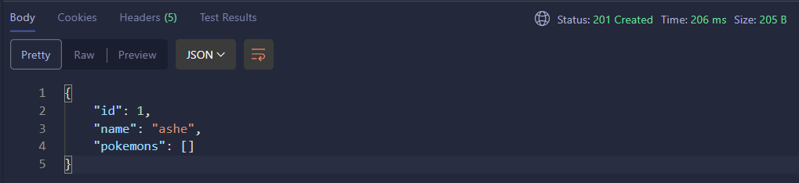
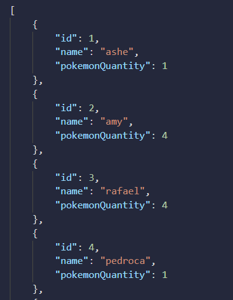
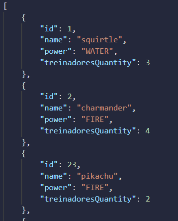
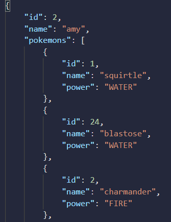
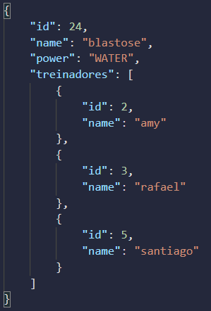

<h1 align="center">@ManytoMany</h1>
 
Aqui, vários treinadores podem ter vários pokemons. Vários pokemons podem ter varios treinadores.


<br>

Quando temos uma relação de **Many to Many** (ninguem é de ninguem). Nós sempre vamos ter 3 tables:

- **table A** --> table pokemon
- **table B** --> table treinador
- **association table** --> Aqui que vamos colocar as foreign keys. Essa e a table para fazermos as queries e pegarmos as informacoes.

💡 Nós não precisamos criar a association table na mão. O Spring automaticamente cria essa table no banco de dados pra nós. Então, nós só vamos precisar criar as 2 entidades padraozin mesmo.

<hr>
<br>

## Criando as entities/tables/models

### entity "treinador"

- **É aqui que vamos criar essa relação** @ManyToMany. 
- É aqui que vamos criar a **association table**.
- Como foi essa entidade que criou a "association table", é aqui que vamos conseguir inserir rows nessa table auxiliar.

```java
@Entity//transformamos essa Class em uma Entity no banco
@Table(name = "tb_treinador") //setamos o nome dessa table 
public class Treinador {
    
    //attributes
    @Id //esse e o campo PRIMARY KEY
    @GeneratedValue(strategy = GenerationType.IDENTITY) //auto_increment
    @Column(name = "id") //configuramos o campo
    private Long id;

    @Column(name = "name", length = 50)
    private String name;


    @ManyToMany(targetEntity = Pokemon.class) //informamos a entity B que queremos fazer relação
    @JoinTable( //criamos uma association table para conseguir relacionar essas 2 entidades. 
        name = "treinador_pokemon", //setamos o nome dessa nova table
        joinColumns = @JoinColumn(name = "treinador_id"), //Criamos o primeiro campo dessa table, que sera a PK da entity A
        inverseJoinColumns = @JoinColumn(name = "pokemon_id") //Criamos o segundo campo dessa table, que sera a PK da entity B
    )
    private Set<Pokemon> pokemons; //esse é o attribute que vamos usar para relacionar as 2 entidades. Usamos 'Set<>' porque nós NÃO QUEREMOS pokemons iguais nessa lista. 1 treinador pode ter VÁRIOS pokemons, porem eles nao se repetem.

    //constructors
    public Treinador(){}
    
    public Treinador(String name){ //usaremos para criar um treinador, sem precisar passar uma lista de pokemons
        this.name = name;
        this.pokemons = new HashSet<>(); //inicializamos essa lista para nao ter problema.
    }

    public Treinador(String name, HashSet<Pokemon> pokemons){  //usaremos para criar um treinador, que já possua pokemons 
        this.name = name;
        this.pokemons = pokemons;
    }

    //getters and setters
    public Long getId() {
        return id;
    }

    public String getName() {
        return name;
    }

    public void setName(String name) {
        this.name = name;
    }

    public Set<Pokemon> getPokemons() {
        return pokemons;
    }

    public void setPokemons(Set<Pokemon> pokemons) {
        this.pokemons = pokemons;
    }

    //toString() 
    @Override
    public String toString(){
        return
            String.format(
                "#ID: %d\n" + 
                "Name: %s\n", this.id, this.name  //NAO MISTURE AS COISAS. SE QUISER RETORNAR A LISTA DE POKEMONS DESSE TREINADOR, CRIE UM METHOD PARA ISSO. Só vamos mostrar os attributes que NÃO TEM RELAÇAO com outras entidades.
            );
    }
}
```

⚠️ Importante colocar o attribute que vai fazer relação como `Set<>`. Isso garante que nao seja possivel ter pokemons iguais nessa lista. Nos dois lados da relação manyToMany, precisamos criar `Set<>`. Assim, garantimos que a primary key dessa "association table" seja a combinacao dos 2 campos.

<br>
<br>

### entity "pokemon"
- É aqui que vamos mapear/confirmar essa relação. Vamos informar qual foi o attribute da TABLE A que estabeleceu a relação.

```java
@Entity
@Table(name = "tb_pokemon")
public class Pokemon {
    
    //attributes

    @Id //esse e o campo PRIMARY KEY
    @GeneratedValue(strategy = GenerationType.IDENTITY) //auto_increment
    @Column(name = "id") //configuramos o campo
    private Long id;

    @Column(name = "name", length = 50)
    private String name;

    @Column(name = "power", length = 50)
    @Enumerated(EnumType.STRING) //informamos que esse campo é um "ENUM". Assim, conseguimos converter para String no banco
    private PokemonPower power;


    @ManyToMany(mappedBy = "pokemons") //confirmamos a relação, informando o attribute da entidade A que iniciou essa relacao.
    private Set<Treinador> treinadores;

    //constructors
    public Pokemon(){}

    public Pokemon(String name, PokemonPower power){ //usaremos para criar um pokemon, sem precisar passar uma lista de treinadores
        this.name = name;
        this.power = power;
        this.treinadores = new HashSet<>(); //inicializamos essa lista para nao ter problema.
    }

    public Pokemon(String name, PokemonPower power, HashSet<Treinador> treinadores){ //usaremos para criar um pokemon, sem precisar passar uma lista de treinadores
        this.name = name;
        this.power = power;
        this.treinadores = treinadores;
    }

    //getters and setters
    public Long getId() {
        return id;
    }

    public String getName() {
        return name;
    }

    public void setName(String name) {
        this.name = name;
    }

    public PokemonPower getPower() {
        return power;
    }

    public void setPower(PokemonPower power) {
        this.power = power;
    }

    public Set<Treinador> getTreinadores() {
        return treinadores;
    }

    public void setTreinadores(Set<Treinador> treinadores) {
        this.treinadores = treinadores;
    }

    //toString()
    @Override
    public String toString(){
        return
            String.format(
                "#ID: %d\n" + 
                "#Name: %s\n" + 
                "Power: %s\n", this.id, this.name,this.power  //NAO MISTURE AS COISAS. SE QUISER RETORNAR A LISTA DE POKEMONS DESSE TREINADOR, CRIE UM METHOD PARA ISSO. Só vamos mostrar os attributes que NÃO TEM RELAÇAO com outras entidades.
            );
    }
}
```

- ⚠️ O attribute que tem relação, PRECISA SER `SET<>`. Assim, garantimos que na table auxiliar será criado uma primary key da combinação dos 2 campos.

- ⚠️ Ao mesmo tempo, use a annotation `@JsonIgnore` para evitar erro de JSON.

<br>

Se ligou??? Sempre que quisermos relacionar 2 entities, precisamos criar 1 attribute extra em cada entity. É através desse campo que conseguimos relacionar essas entidades.

Aí vai depender do tipo da relação...

- Se um treinador pode ter varios pokemons, criamos uma **List/Set de pokemons**
- Se um treinador pode ter apenas 1 pokemon, criamos um Objeto Pokemon.

<br>

- **Muitos** --> Criamos uma lista
- **One** --> Criamos apenas um objeto

<br>

⚠️ Importante lembrar também que se nós não inicializarmos o attribute `Set<>`, não vamos conseguir adicionar items nessa lista. Por isso é importante inicializarmos essa lista em todos os constructors.

<br>

⚠️ RESPIRA! Existem várias formas de cadastrar/listar/editar/deletar os treinadores e pokemons. Veremos isso no final. Primeiro, apenas aprenda a como relacionar as entidades nas suas 3 formas. Depois, faremos uma API, utilizando de uma dessas relações.

<hr>
<br>

## Criando alguns registros e depois relacionando
Aqui, a relação manyToMany funciona da mesma forma. *Como que voce vai adicionar dados na tabela auxiliar, se esses dados ainda nao existem??*

<br>

**Table auxiliar**

| treinador_id(FK) | pokemon_id(FK) |
| :---:            | :---:          |
| Ash              | Pikachu        |

<br>

Se ainda não existe um "Ash" no banco de dados e um "Pikachu", como voce vai preencher essa tabela?? Vai ser gerado uma Exception.

Por isso, precisamos primeiro criar esses dados, treinador e pokemon, e DEPOIS criamos essa relação, preenchendo essa table auxiliar.

Igual quando criamos uma relação ManyToMany no SQL PURO... Nao tem como voce colocar dados na table associativa, sem antes ter criado o "treinador" e depois o "pokemon". **Primeiro criamos os dados e depois relacionamos.**

<br>

Para facilitar, crie alguns treinadores e alguns pokemons, utilizando SQL puro no terminal do Postgres

<hr>
<br>

## POST treinadores (criando treinadores)

Para criar dados, vai funcionar igualzinho qualquer outra entidade. Vamos criar o objeto, PORÉM.... NÃO VAMOS MEXER COM O ATTRIBUTE QUE FAZ A RELEÇÃO ENTRE AS 2 ENTIDADES.

💡 Não fique bitolado em tratar todas as RuntimeExceptions. Crie apenas os treinadores e pokemons da forma mais simples possível

💡 Crie os DTOs necessários:
 
- **TreinadorCreateDTO**
    - "name"

<br>

- **TreinadorFullDTO**
    - id;
    - name;
    - `Set<PokemonFullWithoutTreinadoresDTO>` pokemons;

<br>

⚠️ Para nao acontecer loop infinito na hora de retornar um treinadorFullDto, a lista de pokemons desse treinador também precisa ser um DTO.

<br>
<br>

### TreinadorController

```java
// ============== POST ==============
@PostMapping("/treinadores")
public ResponseEntity<TreinadorFullDTO> createTreinador(@RequestBody TreinadorCreateDTO treinadorOnlyName){
    return ResponseEntity
        .status(HttpStatus.CREATED)
        .body(this.ts.createTreinador(treinadorOnlyName));
}
``` 

<br>
<br>

### TreinadorService

```java
 // ============== POST ==============
public TreinadorFullDTO createTreinador(TreinadorCreateDTO treinadorOnlyName){
    
    if(treinadorOnlyName.getName() == null || treinadorOnlyName.getName().isBlank()){ //poderiamos ter feito várias validacoes.... Porem, objetivo aqui é deixar o mais simples possível
        throw new RuntimeException("O campo 'name' está em branco");
    }

    //criamos um "treinador Cru" para salvarmos no banco
    Treinador treinadorCru = new Treinador(treinadorOnlyName);
    this.tr.save(treinadorCru);

    return new TreinadorFullDTO(treinadorCru);
}
```

📖 Perceba que nós só passamos os attributes normais do "treinador". Não informamos o #ID nem a lista de pokemons. Como nao passamos #ID, o `.save()` cadastrou no banco.

<br>

✏️ Crie 2 treinadores



⚠️ Para nao acontecer um loop infinito na hora de retornar um treinadorFullDto, o attribute "pokemons" também deve ser um DTO.

<hr>
<br>

## POST pokemons (criando pokemons)

Crie os seguntes DTOs:

- PokemonFullWithoutTreinadoresDTO
    - Long id;
    - String name;
    - PokemonPower power;

<br>

- PokemonCreateDTO
    - name;
    - power;

<br>

✏️ Crie 2 pokemons

<br>
<br>

### PokemonController

```java
@RestController
@RequestMapping("/api/v1")
public class PokemonController {
    
    //attributes
    private PokemonService ps;

    //constructors
    public PokemonController(PokemonService ps){
        this.ps = ps;
    }

    // ============== POST ==============
    @PostMapping("/pokemons")
    public ResponseEntity<PokemonFullWithoutTreinadoresDTO> createPokemon(@RequestBody PokemonCreateDto pokemonCreateDto){
        return ResponseEntity
            .status(HttpStatus.CREATED)
            .body(this.ps.createPokemon(pokemonCreateDto));
    }
}
```

<br>
<br>

### PokemonService

```java
@Service
public class PokemonService {
    
    //attributes
    private PokemonRepository pr;

    //constructors
    public PokemonService(PokemonRepository pr){
        this.pr = pr;
    }

    // ============== POST ==============
    public PokemonFullWithoutTreinadoresDTO createPokemon(PokemonCreateDto pokemonCreateDto){
        
        Pokemon pokemonCru = new Pokemon(); //pokemon cru para salvar no banco

        //name validations
        PokemonNameValidations.pokemonNameisNotNull(pokemonCreateDto.getName());
        PokemonNameValidations.pokemonNameisUnique(pokemonCreateDto.getName(), this.pr);

        pokemonCru.setName(pokemonCreateDto.getName()); //tudo certo, setamos o 'name'
        
        //power validations
        PokemonPowerValidations.pokemonPowerIsNotNull(pokemonCreateDto.getPower());
        PokemonPowerValidations.pokemonPowerExists(pokemonCreateDto.getPower());
        
        switch(pokemonCreateDto.getPower()){ //tudo certo, setamos o 'power'
            case "fire":
                pokemonCru.setPower(PokemonPower.FIRE);
                break;
            case "water":
                pokemonCru.setPower(PokemonPower.WATER);
                break;
            case "grass":
                pokemonCru.setPower(PokemonPower.GRASS);
                break;
        }

        this.pr.save(pokemonCru); //salvamos no banco

        return new PokemonFullWithoutTreinadoresDTO(pokemonCru);
    }
}
```

📖 Deu tudo certo porque não mexemos com o attribute que faz conexao. Primeiro, apenas criamos o treinador e o pokemon e só depois fazemos a relação, preenchendo a table auxiliar.

<hr>
<br>

## association table

Essa é a table que vamos usar para relacionar essas 2 tables (**tb_treinador** e **tb_pokemon**). Com ela, conseguimos responder:
- Tal treinador tem quantos pokemons?
- Tal pokemon tem quantos treinadores?

Quando estamos trabalhando com uma relação **Many-to-Many**, nós criamos uma **association table**. Essa association table possui apenas 2 campos:

- **Campo1** --> Foreign key fazendo referencia a tableA
- **Campo2** --> Foreign key fazendo referencia a tableB

⚠️ Essa **association table** NÃO precisa ter um campo com primary key. Esses dois campos bastam. A primary key dessa table será a combinação desses 2 campos. Assim, não poderá ser inserido uma combinacao desses 2 campos iguais. Ex:

Se voce colocar "ashe" + "picachu".... Nao dá pra colocar esses 2 campos juntos novamente. 

A primary key faz com que um campo seja unico. Quando colocamos 2 campos na primary key, estamos dizendo que nao vai existir uma combinacao igual desses 2 campos, sacou?

<br>

Agora sim, depois de criarmos esses caras no banco, conseguimos relacioná-los.
Se fossemos usar SQL puro raiz, nós criaríamos uma row na table auxiliar, preenchendo com #treinador_id e #pokemon_id.

Aqui, vai funcionar igual. Porém, nós fazemos isso utilizando o attribute que eles tem relação. Ou seja, para acessar a 3º table/table auxiliar, nós fazemos isso atraves do campo que tem relação.

⚠️ Nós acessamos a table auxiliar, para cadastrar novos registros, ATRAVÉS DA ENTIDADE QUE CRIAMOS A TABLE AUXILIAR (`@JoinTable`). 

Nesse caso, a entidade que vai ser responsável em criar registros na table auxiliar será a entidade "Treinador", através do seu method .`getPokemons.add()`.

- ash.`getPokemons()` --> Acessamos a table auxiliar.
- ash.`getPokemons().add(pikachu)` --> Estamos acessando a table auxiliar, onde o primeiro lado da relacao é o "#ID referente ao Ash" e o segundo lado da relacao é o "#ID referente ao pikachu".

Como estamos acessando a tabela auxiilar diretamente por um registro único, o jpa automaticamente identifica o primeiro lado da relação.

<br>

❗ NÃO É POSSÍVEL CADASTRAR REGISTROS NA TABLE AUXILIAR pela Entidade que apenas referencia a relação. Nós só podemos cadastrar registros na table auxiliar através da entidade que criou essa table auxiliar, utilizando o `@JoinTable`.


<br>

✏️ Adicione todos os pokemons criados ao treinador "Ash".

Nós acessamos a table auxiliar sempre pela entidade que a criou (`@JoinTable`)

<hr>
<br>


### TreinadorController
Vamos criar uma rota para adicionar pokemons a um treinador. É aqui que vamos criar a relação entre as tables, através da table auxiliar.

```java
// ============== POST ==============
@PostMapping("/treinadores/{id}/adicionar_pokemons")
public ResponseEntity<TreinadorFullDTO> createTreinador(@PathVariable("id") Long treinadorId, @RequestBody List<Long> pokemonIds){
    return ResponseEntity
        .status(HttpStatus.OK)
        .body(this.ts.addPokemons(treinadorId, pokemonIds));
}
```

<br>

### TreinadorService

💡 Crie os methods de validacao em um Class externa. Assim, fica mais clean de ler o código

```java
@Service
public class TreinadorService {
    
    //attributes
    private TreinadorRepository tr;
    private PokemonRepository pr;

    //constructors
    public TreinadorService(TreinadorRepository tr, PokemonRepository pr){
        this.tr = tr;
        this.pr = pr;
    }

    // ============== POST add pokemons ==============
    public TreinadorFullDTO addPokemons(Long treinadorId, List<Long> pokemonIds){

        //verificamos se o treinador existe
        TreinadorValidations.treinadorExists(treinadorId, this.tr);

        //verificamos se os pokemons #IDs existem
        TreinadorValidations.pokemonsExists(pokemonIds, this.pr);

        Treinador treinadorCru = this.tr.findById(treinadorId).get();

        //criamos uma lista/set desses pokemons
        Set<Pokemon> pokemonsCrus = new HashSet<>();

        pokemonIds.stream()
            .forEach((pokemonId) -> {
                Pokemon pokemonCru = this.pr.findById(pokemonId).get();
                pokemonsCrus.add(pokemonCru);
            });

        //verificamos se o treinador ja possui algum desses pokemons
        TreinadorValidations.treinadorDoesNotHaveThesePokemons(pokemonsCrus, treinadorCru);

        //tudo certo... Adicionamos nos dois lados da relação.
        pokemonsCrus.stream()
            .forEach((pokemon) -> {
                pokemon.getTreinadores().add(treinadorCru); //adicionamos em um lado da relacao
                this.pr.save(pokemon); //salvamos a alteracao desse pokemon no banco
                treinadorCru.getPokemons().add(pokemon); //adicionamos no outro lado da relacao também
            });

        this.tr.save(treinadorCru);
        
        return new TreinadorFullDTO(treinadorCru);
    }
}
```
<br>

DALE! Ao mesmo tempo que adicionamos um "pokemon" na lista de pokemons desse treinador, criamos um registro na table auxiliar.

Porém... Se voce tentar registrar esses dados novamente, vai registrar com duplicidade. 

- "#ID_ash" + "#ID_charmander"
- "#ID_ash" + "#ID_charmander"

Se eu disse que o "Ash" tem o "charmander", pq vou dizer novamente isso?? Não pode.
A table auxiliar possui registros onde a combinacao dos 2 campos DEVE ser um registro único.

Por isso usamos `Set<>` onde nao permite valores dupliados.

Ex:

O treinador  "tal" pode ter vários pokemons, desde que eles nao se repitam.
O pokemon "tal" pode ter vários treinadores, desde que eles nao se repitam.


⚠️ Ao mesmo tempo, use a annotation `@JsonIgnore` na entidade que mapeia, para evitar erro de JSON.


<br>
<br>

### TreinadorValidations

```java
public abstract class TreinadorValidations {
    
    //check if the 'treinador' exists
    public static Boolean treinadorExists(Long treinadorId, TreinadorRepository tr){
        tr.findById(treinadorId)
            .orElseThrow(() -> new RuntimeException(String.format("Treinador #%d not found!", treinadorId)));
        
            return true;
    }


    //check if the 'pokemons' #IDs exists
    public static Boolean pokemonsExists(List<Long> pokemonIds, PokemonRepository pr){

        pokemonIds.stream()
            .forEach((pokemonId) -> {
                pr.findById(pokemonId)
                    .orElseThrow(() -> new RuntimeException(String.format("Pokemon #%d doesn't exists", pokemonId)));
            } );

        return true;
    }


    //check if the 'treinador' already has those pokemons
    public static Boolean treinadorDoesNotHaveThesePokemons(Set<Pokemon> pokemons, Treinador treinador){
        pokemons.stream()
            .forEach((pokemon) -> {
                if(treinador.getPokemons().contains(pokemon)){
                    throw new RuntimeException(String.format("Treinador ja possui o pokemon '%s'", pokemon.getName()));
                }
            });
        return true;
    }
}
```

<hr>
<br>

## GET treinadores e GET pokemons
Vamos criar as rotas GET para trazer todos os treinadores e pokemons.

<br>

### GET Treinadores
Liste todos os treinadores, mostrando quantos pokemons eles possuem. Só criar o seguinte DTO:



<br>

#### TreinadorController

```java
//============== GET ==============
@GetMapping("/treinadores")
public ResponseEntity<List<TreinadorFullDTOCountPokemons>> getTreinadores(){
    return ResponseEntity
        .status(HttpStatus.OK)
        .body(this.ts.getTreinadores());
}
```

<br>

#### TreinadorService

```java
// ============== GET ==============
public List<TreinadorFullDTOCountPokemons> getTreinadores(){

    List<TreinadorFullDTOCountPokemons> treinadoresFullDtos = new ArrayList<>();

    this.tr.findAll().stream()
        .forEach((treinador) -> {
            TreinadorFullDTOCountPokemons treinadorDto = new TreinadorFullDTOCountPokemons(treinador);
            treinadoresFullDtos.add(treinadorDto);
        });
    return treinadoresFullDtos;
}
```

<hr>
<br>

### GET Pokemons
Liste todos os pokemons, mostrando quantos treinadores eles possuem. Só criar o seguinte DTO:



<br>

#### PokemonController

```java
// ============== GET ==============
@GetMapping("/pokemons")
public ResponseEntity<List<PokemonFullDTOCountTreinadores>> getPokemons(){
    return ResponseEntity
        .status(HttpStatus.OK)
        .body(this.ps.getPokemons());
}
```

<br>

#### PokemonService

```java
// ============== GET ==============
public List<PokemonFullDTOCountTreinadores> getPokemons(){

    List<PokemonFullDTOCountTreinadores> pokemonsFullDtos = new ArrayList<>();

    this.pr.findAll().stream()
        .forEach((pokemon) -> {
            PokemonFullDTOCountTreinadores pokemonDto = new PokemonFullDTOCountTreinadores(pokemon);
            pokemonsFullDtos.add(pokemonDto);
        });
    return pokemonsFullDtos;
}
```

<br>
<hr>

## GET treinador by #ID e GET pokemon by #ID

### GET treinador by #ID
Buscar um treinador pelo #ID, mostrando todos os seus attributes, inclusive seus treinadores.



<br>

#### TreinadorController

```java
@GetMapping("/treinadores/{id}")
public ResponseEntity<TreinadorFullDTO> getTreinadores(@PathVariable("id") Long treinadorId){
    return ResponseEntity
        .status(HttpStatus.OK)
        .body(this.ts.getTreinadorById(treinadorId));
}
```

<br>

#### TreinadorService

```java
public TreinadorFullDTO getTreinadorById(Long treinadorId){
    //verificamos se o treinador existe no banco
    TreinadorValidations.treinadorExists(treinadorId, this.tr);

    Treinador treinadorCru = this.tr.findById(treinadorId).get();

    return new TreinadorFullDTO(treinadorCru);
}
```

<hr>
<br>


### GET pokemon by #ID
Buscar um treinador pelo #ID, mostrando todos os seus attributes, inclusive seus treinadores.



<br>

#### PokemonController

```java
 @GetMapping("/pokemons/{id}")
public ResponseEntity<PokemonFullDTO> getPokemonById(@PathVariable("id") Long pokemonId){
    return ResponseEntity
        .status(HttpStatus.OK)
        .body(this.ps.getPokemonById(pokemonId));
}
```

<br>

#### PokemonService

```java
public PokemonFullDTO getPokemonById(Long pokemonId){
    //verificamos se o pokemon existe no banco
    PokemonValidations.pokemonExists(this.pr, pokemonId);

    Pokemon pokemonCru = this.pr.findById(pokemonId).get();

    return new PokemonFullDTO(pokemonCru);
}
```

📖 Como tinhámos adicionado os treinadores na lista desses pokemons, é só usar o `getTreinadores()`.

<hr>
<br>

## Criando parametros no request com `@RequestParam`

Vamos modificar a rota de listar todos os treinadores, criada [aqui](#get-treinadores).

Utilizando os `@RequestParam`, o usuário vai ter a opcao de fazer os seguintes filtros:

- Filtrar apenas treinadores que **possuam o pokemon "pikachu"** --> `http://localhost:8080/api/treinador?pokemonName=charizard`
- Filtrar apenas treinadores que **possuam mais de 2 pokemons** --> `http://localhost:8080/api/treinador?quantidadePokemons=3`
- Usando os dois filtros ao mesmo tempo --> `http://localhost:8080/api/treinador?pokemonName=raikou&quantidadePokemons=3`

<br>

💡 Lembrando, que se o usuario nao passar esses `@RequestParams`, retornamos a lista completinha.

<br>
<br>

### TreinadorController

```java
//============== GET ==============
@GetMapping("/treinadores")
public ResponseEntity<List<TreinadorFullDTOCountPokemons>> getTreinadores(
    @RequestParam(name = "pokemon_name", required = false) String pokemonName,
    @RequestParam(name = "quantity", required = false) Integer quantidadePokemon
)
{
    return ResponseEntity
        .status(HttpStatus.OK)
        .body(this.ts.getTreinadores(pokemonName, quantidadePokemon));
}
```

<br>

### TreinadorService

```java
public List<TreinadorFullDTOCountPokemons> getTreinadores(String pokemonName, Integer pokemonQuantity){

    List<TreinadorFullDTOCountPokemons> treinadoresFullDtos = new ArrayList<>();

    List<Treinador> treinadoresCrus = new ArrayList<>();

    //request params
    if(pokemonName == null && pokemonQuantity == null){
        treinadoresCrus = this.tr.findAllDefault();
    }
    else if(pokemonName != null && pokemonQuantity == null){
        treinadoresCrus = this.tr.findAll(pokemonName);
    }
    else if(pokemonName == null && pokemonQuantity != null){
        treinadoresCrus = this.tr.findAll(pokemonQuantity);
    }
    else{
        treinadoresCrus = this.tr.findAll(pokemonName, pokemonQuantity);
    }

    treinadoresCrus.stream()
        .forEach((treinador) -> {
            TreinadorFullDTOCountPokemons treinadorDto = new TreinadorFullDTOCountPokemons(treinador);
            treinadoresFullDtos.add(treinadorDto);
        });

    return treinadoresFullDtos;
}
```

<br>

### TreinadorRepository

```java
@Repository
public interface TreinadorRepository extends JpaRepository<Treinador, Long> {
    
    //queries
    @Query(value = "SELECT t FROM Treinador t ORDER BY t.id ASC")
    public List<Treinador> findAllDefault();

    //Listar apenas os treinadores que possuam o pokemon "pikachu"
    @Query(value = "SELECT t FROM Treinador t JOIN t.pokemons p WHERE p.name = :pokemonName ORDER BY t.id ASC") // Essa query, vai retornar um Treinador. Fizemos um JOIN na table auxiliar, representada pelo attribute que tem relação. Assim, o Hibernate consegue identeificar automaticamente a porra toda. Podendo aplicar os filtros em qualquer das 2 entidades.
    public List<Treinador> findAll(@Param("pokemonName") String name);

    //Listar apenas os treinadores que possuam mais que "tantos" pokemons
    @Query(value = "SELECT t FROM Treinador t WHERE SIZE(t.pokemons) > :quantity ORDER BY t.id ASC")
    public List<Treinador> findAll(@Param("quantity") Integer quantity);

    //Aplicar os dois filtros
    @Query(value = "SELECT t FROM Treinador t JOIN t.pokemons p WHERE p.name = :pokemonName AND SIZE(t.pokemons) > :pokemonQuantity ORDER BY t.id ASC") //JPQL. Referenciamos pela Entidade e seus attributes. Perceba que o JOIN eh no attribute que representa a table auxiliar. Assim, conseguimos aplicar filtros de ambas as entidades.
    public List<Treinador> findAll(@Param("pokemonName") String name, @Param("pokemonQuantity") Integer quantity);
}

```

💡 Nas Repositories, trabalhe sempre com **List**. Se não, as queries podem dar problema.

<br>

📖 Sempre que vamos fazer uma query JPQL, devemos lembrar que referenciamos pelas entidades e seus attributes. Se queremos filtrar por campos da entidade B, devemos dar `JOIN` no attribute que faz essa conexao entre as duas entidades.

<br>

💡 Nao se afobe, voce não precisa decorar a porra toda. O JPQL tem suas peculiaridades.

<br>

💡 Antes de sair fazendo a query, faca a query no SQl puro. Assim, já da pra ter uma ideia de como vai ficar a query no JPQL.