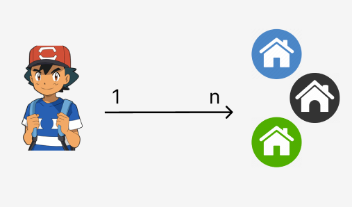

<h1 align="center">@OneToMany</h1>
 
<div style="display:flex; justify-content:center">
    
</div>

<br>

Aqui, temos uma relação de 1 para muitos.

1 Pessoa pode ter vários enderecos/casas. Ao mesmo tempo, esses enderecos podem ser de apenas 1 pessoa.


💡 Nessa relação, nós SEMPRE colocamos a Foreign Key no lado **Many**.💡


Vamos precisar de 2 tables:

- **Table A** --> tb_person
- **Table B** --> tb_address --> Vamos ter um campo com um FK, referenciando a outra table.


⚠️ A FK referenciando a outra table, SEMPRE é feita do lado **Many**.


<br>

Vai funcionar igual as outras relações... No primeiro lado da relação, nós criamos a relação. Depois, nós mapeamos/confirmamos essa relação na entidade B. 

<br>

## Criando as entities 'Person' and 'Address

### Person

```java
@Entity
@Table(name = "tb_person")
public class Person {
    
    //attributes

    @Id
    @GeneratedValue(strategy = GenerationType.IDENTITY)
    @Column(name = "id")
    private Long id;

    @Column(name = "name", length = 50)
    private String name;

    @OneToMany(mappedBy = "owner") //Confirmamos/mapeamos a relação, informando o campo da outra entidade que solicitou a relacao.
    Set<Address> addresses = new HashSet<>(); //Uma pessoa pode ter VÁRIOS addresses... Entao, criamos uma lista.


    //constructors
    public Person(String name){
        this.name = name;
    }

    //getters and setters
    public Long getId() {
        return id;
    }


    public String getName() {
        return name;
    }


    public void setName(String name) {
        this.name = name;
    }


    public Set<Address> getAddresses() {
        return addresses;
    }


    public void setAddresses(Set<Address> addresses) {
        this.addresses = addresses;
    }
}
```

<br>

### Address

```java
@Entity
@Table(name = "tb_address")
public class Address {

    //attributes

    @Id
    @GeneratedValue(strategy = GenerationType.IDENTITY)
    @Column(name = "id")
    private Long id;


    @Column(name = "street", length = 50)
    private String street;

    @Column(name = "number")
    private Integer houseNumber;


    @ManyToOne(targetEntity = Person.class) //Informamos que queremos ter uma relação com outra entidade.
    @JoinColumn(name = "person_id") //Essa é a parte MANY da relaçao. Portanto, criamos o campo adicional, referenciando a PK da outra entidade, aqui.
    private Person owner; //Um endereco pode ser de apenas 1 pessoa. Portanto, nao criamos uma lista e sim uma "Pessoa" unica
  

    //constructors
    public Address(String street, Integer houseNumber, Person owner) {
        this.street = street;
        this.houseNumber = houseNumber;
        this.owner = owner;
    }


    //getters and setters
    public Long getId() {
        return id;
    }

    public String getStreet() {
        return street;
    }

    public void setStreet(String street) {
        this.street = street;
    }

    public Integer getHouseNumber() {
        return houseNumber;
    }

    public void setHouseNumber(Integer houseNumber) {
        this.houseNumber = houseNumber;
    }

    public Person getOwner() {
        return owner;
    }

    public void setOwner(Person owner) {
        this.owner = owner;
    }
}
```

<hr>
<br>

## Criando "Persons" and Criando "Addresses"
Perceba que criar uma "Person" é tranquilo. Essa entidade/table possui apenas os campos padraozin:
- id
- name

Já na entidade Addresses, precisamos tomar cuidado. Não é possível criar um endereco sem mencionar a "person" que é dona daquele endereco.

<br>


### Criando "Persons"

Para simplificar, vamos trabalhar apenas com a class "PersonRepository" and "PersonController"

💡 Se sentir necessidade de usar DTOs, use e abuse.

```java
//CONTROLLER

@PostMapping("")
public Person createPerson(@RequestBody(required = true) Person newPerson){
    return this.pr.save(newPerson); //salvamos no banco
}


//READ All
@GetMapping("")
public List<PersonDTOFull> getAllPersons(){
    return PersonDTOFull.converterAddress(this.pr.findAll()); //criamos um method para converter uma "lista crua" em uma "lista DTO Full"
}
```

💡 Se der erro de looping infinito, use o `@JsonIgnore`.

<br>
<br>


### Criando "Addresses"
Aqui, vamos criar um DTOzinho para enviar um endereco simplificado. O endereco que nos vamos enviar no body, vai conter os attributes:

- street
- houseNumber
- owner_id


<br>

✏️ Crie varios enderecos em uma mesma Pessoa. Afinal, uma "pessoa" pode ter vários "enderecos".
<br>

```java
//READ
@GetMapping("")
public List<Address> getAllAddresses(){
    return this.ar.findAll();
}


//CREATE
@PostMapping("")
public Address createAddress(@RequestBody(required = true) AddressDTOCreate novoAddress){
    
    //um endereco esta associado a uma "Person". Portanto, um address nao pode ter o campo "owner" em branco
    if(novoAddress.getOwnerId() == null){
        throw new RuntimeException("Esse endereco deve pertencer á alguma 'Pessoa'");
    }

    //Endereco possui um dono??? Vamos verificar se esse dono existe no banco de dados
    Optional<Person> pOptional = this.pr.findById(novoAddress.getOwnerId());


    if(pOptional.isEmpty()){
        throw new RuntimeException(String.format("Não foi possível cadastrar o endereco, pois o owner #%d nao existe.",novoAddress.getOwnerId()));
    }


    //Tudo certo. O campo/attribute "ownerID" foi informado, e esse owner de fato existe no banco.
    //Agora, é só criar esse endereco
    Person addressOwner = pOptional.get();

    Address a1 = new Address(
        novoAddress.getStreetName(),
        novoAddress.getHouseNumber(),
        addressOwner
    );

    this.ar.save(a1); // salvamos esse endereco no banco.
    
    return a1;
}
```

💡 DTOzinhos salvam nossas vidas. 😎

<br>

Perceba que conseguimos fazer uma relação `@OneToMany` entre duas entidades. Onde, uma "Person" pode ter VÁRIOS addresses. Porém, esses addresses pertencem a apenas 1 pessoa.

<br>
<br>

✏️ Adicione 1 `@RequestParam()` para mostrar apenas os enderecos de determinado owner. Filtro pelo owner_id.

```java
//REPOSITORY

//Find All, sem filtro
@Query(nativeQuery = false, value = "SELECT a FROM Address a ORDER BY a.id ASC")
public List<Address> findAll();


//Find All, filtrando por enderecos de "tal" Person
@Query(nativeQuery = false, value = "SELECT a FROM Address a WHERE a.owner.id = :ownerId") //Perceba que nós acessamos o attribute "owner" da entidade "Address". Depois, acessamos o attribute "id" da entidade Person. Quando acessamos o attribute "owner", é como se nós tivessemos entrado na entidade "Person", sacou?
public List<Address> findAll(@Param(value = "ownerId") Long ownerId);


//CONTROLLER
@GetMapping("")
public List<Address> getAllAddresses(
    @RequestParam(value =  "ownerId", required = false) Long ownerId
){
    if(ownerId != null){
        return this.ar.findAll(ownerId);
    }
    return this.ar.findAll();
}
```