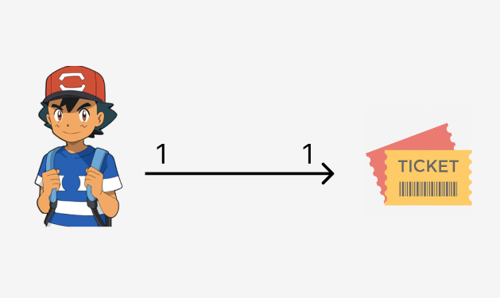

<h1 align="center">@OneToOne</h1>
 


<br>

Aqui é bem parecido com a relação OneToMany. A diferença é que aqui, podemos escolher em qual entidade vamos criar o campo adicional com a FK da outra entidade.

Vamos trabalhar com o seguinte exemplo:

Imagine que acontecer o show de um artista...

- 1 pessoa pode ter apenas 1 ingresso.
- 1 ingresso pode ser de apenas 1 pessoa.

Aqui, também vamos ter 2 tables:

- **table A** --> tb_ticket  (*podemos colocar a FK aki*)
- **table B** --> tb_person  (*podemos colocar a FK aki*)

💡 Nessa relação, voce pode escolher qualquer uma das tables para criar o campo de referencia. A escolha vai depender da sua lógica.

<br>

Nesse exemplo, vamos fazer o seguinte:

**tb_ticket**

| id      | numero_cadeira | person_id (*FK*)|
| :---:   | :---:          | :---:  |


<br>

**tb_person**

| id      | name   |
| :---:   | :---:  |

<br>

Perceba que um ingresso nao pode ser criado sem que mencionemos a pessoa que e dono desse ingresso.

<br>

<hr>
<br>

## Criando a entidade "Person"
Aqui, vamos apenas mapear a relação. Não queremos o campo nessa entidade.

```java
@Entity //criamos uma entity
@Table(name = "tb_person") //setamos o nome da table
public class Person {
    
    //attributes
    @Id //primary key
    @GeneratedValue(strategy = GenerationType.IDENTITY) //auto_increment
    @Column(name = "id") //setamos as configs desse campo
    private Long id;

    @Column(name = "name", length = 320)
    private String name;

    @JsonIgnore //cancelamos o looping infinito de relacionamento
    @OneToOne(mappedBy = "owner", cascade = CascadeType.ALL) //nao queremos criar um campo nessa entidade/table. Portanto, apenas mapeamos a relação, informando o attribute da outra entidade que startou a relacao. Quem vai criar o campo será a outra entidade.
    private Ticket ticket; //como uma pessoa pode ter APENAS 1 ticket, criamos apenas 1 objeto

    //constructors
    public Person(){}

    public Person(String name){ //podemos criar uma pessoa, sem precisar dizer o ticket dela
        
    }


    public Person(PersonDTOCreate newPerson){ //usaremos esse constructor para pegar os dados de uma DTO, passado na hora de criar uma "person"
        this.name = newPerson.getName();
    }

    //getters and setters
    public Long getId() {
        return id;
    }

    public void setId(Long id) {
        this.id = id;
    }

    public String getName() {
        return name;
    }

    public void setName(String name) {
        this.name = name;
    }

    public Ticket getTicket() {
        return ticket;
    }

    public void setTicket(Ticket ticket) {
        this.ticket = ticket;
    }


    //toString() se precisar
    @Override
    public String toString() {
        return "Person [id=" + id + ", name=" + name + ", ticket=" + ticket + "]";
    }
}
```

<hr>
<br>

## Criando a entidade "Ticket"
Aqui, vamos criar a relação e adicionar o campo.

Lembrando, que o campo "cadeira_number" tem quer unico. Afinal, duas pessoas nao ocupam a mesma cadeira. Na hora de informar esse campo, se colocar um numero de cadeira que ja existe, retornamos uma RuntimException padraozin.

```java
@Entity
@Table(name = "tb_ticket")
public class Ticket {
    
    //attributes
    @Id
    @GeneratedValue(strategy = GenerationType.IDENTITY)
    @Column(name = "id")
    Long id;

    @Column(name = "numero_cadeira", unique = true)
    Integer numeroCadeira;

    @OneToOne(targetEntity = Person.class) //estamos criando uma relação 1-1 com a entidade "tal"
    @JoinColumn(name = "owner_id") //Criamos um campo adicional nessa entidade. Esse campo vai ser a PK da entidade A. No caso, person_id.
    Person owner; //como um ticket pode ter APENAS 1 pessoa, criamos apenas um objeto


    //constructor
    public Ticket(){}

    public Ticket(Integer numeroCadeira, Person owner){
        this.numeroCadeira = numeroCadeira;
        this.owner = owner;
    }


    //getters and setters
    public Long getId() {
        return id;
    }

    public void setId(Long id) {
        this.id = id;
    }

    public Integer getNumeroCadeira() {
        return numeroCadeira;
    }

    public void setNumeroCadeira(Integer numeroCadeira) {
        this.numeroCadeira = numeroCadeira;
    }

    public Person getOwner() {
        return owner;
    }

    public void setOwner(Person owner) {
        this.owner = owner;
    }


    //toString() se precisar
    @Override
    public String toString() {
        return "Ticket [id=" + id + ", numeroCadeira=" + numeroCadeira + ", owner=" + owner + "]";
    }
}
```

<hr>
<br>

## Criando "Persons"
Crie 2 rotas:

- Uma rota para **listar todos** as "persons"
- Uma rota para **cadastrar** uma "person"

<br>

💡 Use e abuse dos DTOs. É mais fácil de enviar e receber dados.

<br>

### PersonController

```java
@RestController
@RequestMapping("/api/v1")
public class PersonController {

    //attributes
    private PersonService ps;

    //constructors
    public PersonController(PersonService ps){
        this.ps = ps;
    }
    
    // =================== POST ===================
    @PostMapping("/people")
    public ResponseEntity<PersonFullDto> createPerson(@RequestBody PersonCreateDTO personCreateDTO){
        return ResponseEntity
            .status(HttpStatus.CREATED)
            .body(this.ps.createPerson(personCreateDTO));
    }

    // =================== GET ===================
    @GetMapping("/people")
    public ResponseEntity<List<PersonFullDto>> getAllPeople(){
        return ResponseEntity
            .status(HttpStatus.OK)
            .body(this.ps.getAllPeople());
    }
}
```

Podemos criar uma "Person", sem precisar preencher o ticket. Nós apenas criamos um DTOzinho informando apenas o "name" dessa Person.

<br>

### PersonService

```java
@Service
public class PersonService {

    //attributes
    private PersonRepository pr;

    //constructors
    public PersonService(PersonRepository pr){
        this.pr = pr;
    }
    
    // =================== POST ===================
    public PersonFullDto createPerson(PersonCreateDTO personCreateDTO){

        //verificamos se o o "name" foi preenchido
        PersonMethodsLegais.nameIsNotNull(personCreateDTO.getName());

        Person personCrua = new Person(personCreateDTO);
        this.pr.save(personCrua); //salvamos no banco

        return new PersonFullDto(personCrua);
    }

    // =================== GET ===================
    public List<PersonFullDto> getAllPeople(){
        List<PersonFullDto> personDtoList = new ArrayList<>();

        this.pr.findAll().stream().forEach((personCru) -> {
                PersonFullDto personDto = new PersonFullDto(personCru);
                personDtoList.add(personDto);
            });
        return personDtoList;
    }
}
```

💡 Se der algum problema, verifica os constructors dos seus DTOs.

<hr>
<br>

## Criando "Tickets"
Só vamos conseguir criar "tickets" se eles forem de alguma pessoa.

Aqui vamos precisar validar:


- Os dois campos "cadeiraNumber" and "owner_id" DEVEM ser preenchidos.
- Verificamos se o numero da cadeira já pertence a alguem
- Verificamos se o owner_id existe no banco
- Verificamos se a pessoa já possui algum ticket. 1 pessoa pode ter apenas 1 ticket

<br>

### TicketController

```java
@RestController
@RequestMapping("/api/v1")
public class TicketController {

    //attributes
    private TicketService ts;

    //constructors
    public TicketController(TicketService ts){
        this.ts = ts;
    }

    // =================== POST ===================
    @PostMapping("/tickets")
    public ResponseEntity<TicketFullDto> createTicket(@RequestBody TicketCreateDto ticketCreateDto){
        return ResponseEntity
            .status(HttpStatus.CREATED)
            .body(this.ts.createTicket(ticketCreateDto));
    }
    
    // =================== GET ===================
    @GetMapping("/tickets")
    public ResponseEntity<List<TicketFullDto>> getAllTickets(){
        return ResponseEntity
            .status(HttpStatus.OK)
            .body(this.ts.getAllTickets());
    }
}
```

<br>

### TicketService

```java
@Service
public class TicketService {
    
    //attributes
    private TicketRepository tr;
    private PersonRepository pr;

    //constructors
    public TicketService(TicketRepository tr, PersonRepository pr){
        this.tr = tr;
        this.pr = pr;
    }

    // =================== POST ===================
    public TicketFullDto createTicket(TicketCreateDto ticketCreateDto){

        //pegamos os dados informados no @RequestBody
        Integer chairNumber = ticketCreateDto.getChairNumber();
        Long ownerId = ticketCreateDto.getOwnerId();

        //validacoes
        TicketValidations.chairNumberAndOwnerIdAreNotNull(chairNumber, ownerId);
        TicketValidations.chairNumberIsFree(chairNumber, this.tr);
        TicketValidations.ownerIdExists(ownerId, pr);
        TicketValidations.personDoesNotHaveTicketYet(ownerId, pr);

        Person personCru = this.pr.findById(ownerId).get();

        Ticket ticketCru = new Ticket();
        ticketCru.setChairNumber(ticketCreateDto.getChairNumber());
        
        //bilateralidade
        ticketCru.setOwner(personCru);
        personCru.setTicket(ticketCru);

        //salvamos no banco. Sempre salvamos primeiro a entidade que startou/criou a relação
        this.tr.save(ticketCru);
        this.pr.save(personCru);
        
        return new TicketFullDto(ticketCru);
    }


    // =================== GET ===================
    public List<TicketFullDto> getAllTickets(){
        List<TicketFullDto> ticketDtoList = new ArrayList<>();

        this.tr.findAll().stream().forEach((ticketCru) -> {
            ticketDtoList.add(new TicketFullDto(ticketCru));
        });

        return ticketDtoList;
    }
}
```

- 💡 Sempre salve no banco primeiro a entidade/table que CRIOU a relação. Depois, tu salva a que mapeou.

📖 Para ver os methods de validação clique [aqui](./TicketValidations.java) .

<br>
<br>

### TicketRepository

```java
@Repository
public interface TicketRepository extends JpaRepository<Ticket, Long>{
    //queries
    @Query(value = "SELECT t FROM Ticket t WHERE t.chairNumber = :chair_number")
    public Optional<Ticket> findByChairNumber(@Param("chair_number") Integer chairNumber);
}
```

- 💡 Se der problema de looping infinito, use o `@JsonIgnore` na entidade da relação que mapeia.

<hr>
<br>

## Cascade

✏️ Crie uma rota para deletar uma "Person"

Como a entidade "Person" está sendo referenciada pela entidade "Ticket", só é possível deletar uma "Person" se ela não tiver nenhum vinculo com um ticket. Uma maneira de resolver isso, seria usando o `cascade = CascadeType.ALL`.

Quando usamos o `cascade = CascadeType.ALL` (efeito em cascata), todas as relações da "pessoa tal" são deletadas, e em seguida a "pessoa tal" é deletada.

```java
//DELETE a person
@DeleteMapping("{personId}")
public String deletePerson(@PathVariable(value = "personId") Long personId){
    
    Optional<Person> pOptional = this.pr.findById(personId);

    if(pOptional.isEmpty()){
        throw new RuntimeException(String.format("Person #%d not found...", personId));
    }

    this.pr.deleteById(personId); //deletamos do banco
    return "Successfully deleted!";
}
```

<br>

Poderíamos fazer isso na mão, verificando se `p1.getTicket() != null`.