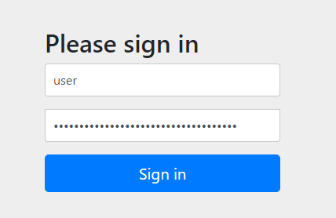
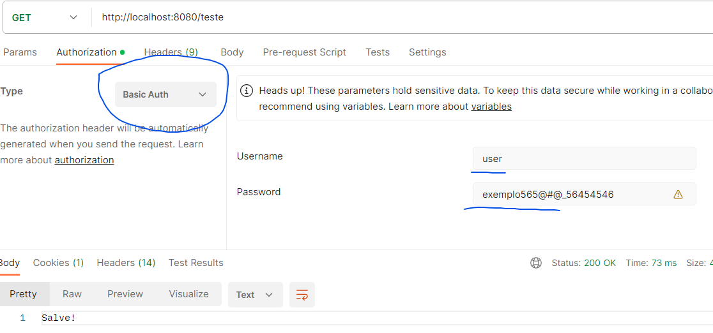

<h1 align="center">
    <span>Spring Security</span>
    
</h1>

O spring security é um módulo do Sring que permite que você proteja suas rotas, garantindo que apenas usuários autorizados tenham acesso a elas.


<hr>
<br>

## Criando uma aplicacao Spring sem segurança

1. 
    Vá no [spring initializr](https://start.spring.io/) e crie um projeto com as seguintes dependencies:

    - **Spring Web** --> Para conseguirmos criar nossas aplicações restful.
    - **Spring Data JPA** --> Comandos SQL já prontos, usando o JpaRepository.
    - **PostgreSQL Driver** --> Para conseguir usar o banco de dados Postgres.
    - **Spring Boot DevTools** --> Sempre que fazemos uma modificacao no projeto, a aplicação é restartada automaticamente


    ❗ Por enquanto, não coloque a dependencie do spring security.

<br>
<br>

2. Configure o aplication.properties

    ```properties
    # Informamos o caminho do banco de dados
    spring.datasource.url=jdbc:postgresql://localhost:5432/security_db

    # Usuário do banco de dados
    spring.datasource.username=postgres

    # Senha do banco de dados. É a senha do usuario postgres
    spring.datasource.password=123

    # Acompanha as alterações feitas nas entidades. Qualquer alteração feita na entidade, a table também vai sofrer alteração.
    spring.jpa.hibernate.ddl-auto=update

    # Mostrar os commands SQL feitos pelo jpa
    spring.jpa.show-sql=true
    ```


<br>
<br>

3. Crie 1 rota GET para retornar uma String

    ```java
    @RestController
    @RequestMapping(path = "/teste")
    public class Controller {
        
        @GetMapping("")
        public String rotaTeste(){
            return "Salve!";
        }
    }
    ```
✏️ Acesse essa rota no [postman](https://www.postman.com/).


Perceba que, como não temos seguranca nas nossas rotas, elas estão livres. Qualquer pessoa pode acessar essas rotas. 

Aí que entra o Spring Security. Justamente para proteger essas rotas. O cliente só vai conseguir entrar em determinada rota se ele for autenticado.

Existem vários tipos de authentication, mas veremos depois.


<hr>
<br>

## Colocando o Spring Security na nossa aplicação

Para colocar o Spring Security na nossa aplicacao, vamos colocar a seguinte dependencie:

```xml
<!-- Spring security  -->
<dependency>
    <groupId>org.springframework.boot</groupId>
    <artifactId>spring-boot-starter-security</artifactId>
</dependency>
```

Sempre que colocamos o spring security na nossa aplicacao, TODAS AS NOSSAS ROTAS SAO PROTEGIDAS.

Se voce tentar acessar a rota criada anteriormente, voce vai receber as respostas:

- **401 Unauthorized**
- **403 forbidden**

<br>

Por padrao, a authentication que vem setada no spring security é a **Basic Auth**. Essa authenticacao contem:

- User: User
- Password: 2b15ads562-a2fb-459c-9050-8091efasd4655ef0


📖 O usuário padrao é "User", e a senha padrão é gerada no terminal da aplicacao.


<br>
<br>

✏️ Acesse a rota criada anteriormente e passe as credenciais da **autenticacao basica** no navegador:



<br>
<br>

✏️ Acesse a rota criada anteriormente e passe as credenciais da **autenticacao basica** no postman:



<br>

Dale! Fomos autenticados. Credenciais corretas, temos acesso a rota. 😎

<hr>

Agora, precisamos criar nossas proprias credenciais e fazer nossas proprias configuracoes de seguranca de rotas.