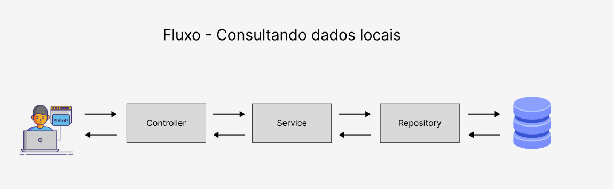
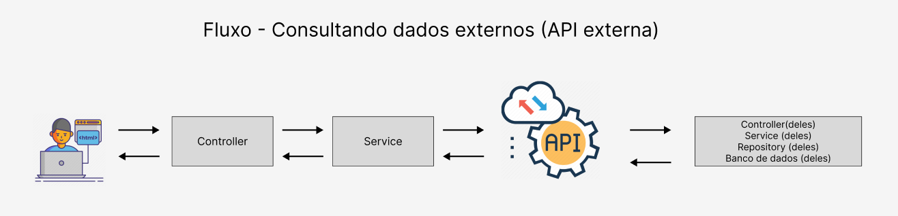

<h1 align="center">
    <span>Consumir API externa</span>
    
</h1>

O fluxo de consultar dados externos é bem parecido com o fluxo de consultar dados locais.



<br>

Entendendo o fluxo de dados local:

- Cliente faz um request/solicitacao HTTP para um endpoint específico da nossa aplicação.

- A Controller verifica o endpoint solicitado, executa o method correspondente, e chama a service.

- A Service trata a lógica de negócio, valida se o request tá tudo certinho e depois chama a repository.

- O Repository faz as consultas no banco de dados local para buscar os dados solicitados no request.

- O fluxo retorna.

<br>
<br>

 

<br>

Aqui, o fluxo para consultar dados externos é bem parecido. A diferença é que ao invés de consultar no nosso banco local, vamos consultar em uma aplicacao externa.

- Cliente faz um request/solicitacao HTTP para um endpoint específico da nossa aplicação.

- A Controller verifica o endpoint solicitado, executa o method correspondente, e chama a service.

- A Service trata a lógica de negócio, valida se o request tá tudo certinho e **faz uma solicitacao para a api externa**.

- A API externa faz todo o procedimento de uma aplicacao local (Controller, Service, Repository e Banco de dados) e devolve para a nossa Service o dado solicitado no request.

- O fluxo retorna.

<hr>
<br>

## Passo a passo 

Para conectar nossa aplicacao com uma aplicacao externa, vamos seguir os seguintes passos:


1. Adicionar a dependencie do feign client (cliente falso) **OpenFeign** .

<br>

2. Ir na Main Class da aplicação e liberar a permissao para acessar APIs externas, utilizando o `@EnableFeignClients`

<br>

3. Criar uma class DTO para receber os attributes do objeto enviado. Como é uma DTO, nós podemos escolher quais attributes queremos receber. Porém, **O NOME DOS ATTRIBUTES DEVE SER IGUAL AO NOME DOS ATTRIBUTES DO OBJETO JSON ENVIADO** .

<br>

4. Criar uma interface para representar a Controller Class da API externa. Funciona igualzinho uma Controller, mas apenas com abstracts methods. Vamos usar um objeto dessa interface para fazer os requests para a api externa.

<br>

5. Criamos uma Service e uma Controller padraozinha.

<br>

💡 Por enquanto, nao vamos usar banco de dados.


<hr>
<br>

## Maos na massa:

Vamos utilizar a API externa da [viaCep](https://viacep.com.br/) para praticarmos. O objetivo vai ser:

O cliente vai fazer, na nossa API, um request para trazer as informacoes de um determinado CEP.

<br>

### Criando o projeto Spring

✏️ Crie um projeto Spring com as seguintes dependencies:

- Lombok --> Getters, Setters and Constructors já criados
- DevTools --> A cada alteracao, reinicia nossa aplicacao automaticamente
- Spring Web --> Nossa aplicacao RestFul
-  **OpenFeign** --> Essa é a dependencie que nos permite fazer requests para APIs externas

<br>

Importante lembrar que a dependencie do **OpenFeign** recebe todas essas informacoes:

```xml
<properties>
		<java.version>17</java.version>
		<spring-cloud.version>2023.0.0</spring-cloud.version> <!-- informamos a versao -->
</properties>

<!-- outras dependencies ^^^^ -->
<dependency>
			<groupId>org.springframework.cloud</groupId>
			<artifactId>spring-cloud-starter-openfeign</artifactId>
			<version>4.0.4</version>
</dependency>
<!-- outras dependencies -->

<dependencyManagement>
	<dependencies>
		<dependency>
			<groupId>org.springframework.cloud</groupId>
			<artifactId>spring-cloud-dependencies</artifactId>
			<version>{spring-cloud-version}</version>
			<type>pom</type>
			<scope>import</scope>
		</dependency>
	</dependencies>
</dependencyManagement> 
```

<hr>
<br>


### Criando nossa DTO Class para receber o objeto JSON da api externa

Vamos na [ViaCep](https://viacep.com.br/) e verificamos quais são os attributes que o objeto JSON possui:

```json
{
    "cep": "01001-000",
    "logradouro": "Praça da Sé",
    "complemento": "lado ímpar",
    "bairro": "Sé",
    "localidade": "São Paulo",
    "uf": "SP",
    "ibge": "3550308",
    "gia": "1004",
    "ddd": "11",
    "siafi": "7107"
}        
```

Como estamos trabalhando com DTO, nós podemos escolher quais os attributes que nos interessa. No caso, vamos querer apenas os attributes:

 - cep
 - logradouro
 - complemento
 - bairro
 - localidade
 - uf

<br>

⚠️ Lembrando que os nomes dos attributes da nossa DTO Class **PRECISAM** ter o mesmo nome dos attributes do objeto JSON da API externa.

<br>

✏️ Crie  uma DTO Class representando o objeto JSON da API externa

```java
public class AddressDto {

    //attributes
    private String cep;
    private String logradouro;
    private String complemento;
    private String bairro;
    private String localidade;
    private String uf;
    private String regiao;

    //constructors
    public AddressDto(){}
    
    //getters and setters
    public String getCep() {
        return cep;
    }
    public void setCep(String cep) {
        this.cep = cep;
    }

    //etc..... Nao precisa criar toString(). Apenas precisamos dos getters() e setters()
}
```

⚠️ Denovo, nós precisamos dar o mesmo nome aos attributes. Se não fizermos assim e criarmos attributes com nomes diferentes, eles receberiam null sacou?? Isso, porque o objeto JSON enviado possui aqueles exatos attributes.

<hr>
<br>

### Criando uma interface para representar a Controller class da API externa

É através dessa interface que vamos conseguir fazer os requests para a API externa. Ao invés de consultar os dados no banco de dados, nós vamos fazer requests para pegar esses dados.

Essa interface vai fingir ser um "cliente". Por isso, `@FeignClient`.

<br>

```java
import org.springframework.cloud.openfeign.FeignClient;
import org.springframework.web.bind.annotation.GetMapping;
import org.springframework.web.bind.annotation.PathVariable;
import br.com.lGabrielDev.api_externa.address.AddressDto;

@FeignClient(name = "viacepInsano", url = "https://viacep.com.br/ws") // URL/RequestMapping da API externa
public interface ExternalApiController {
    
    // ================ GET ================
    @GetMapping("/{cep}/json")
    public AddressDto getAddressByCep(@PathVariable("cep") String cep);
}


//entendendo o código vai ficar assim:
/*
* - Ao instanciar um objeto dessa Interface, estamos fazendo um request/solicitacao para a api externa
* - Informamos o method/rota que queremos fazer o request. Sacou???
*/

```

💡 Perceba que **é aqui que vamos dizer qual vai ser a Class do objeto JSON retornado**. Nesse caso, o objeto JSON que a api externa **viacep** vai retornar será um objeto do tipo "**Address**". Se ligou?? No retorno do method é que informamos.

<hr>
<br>

### Criando uma Service e uma Controller padraozinhas

<br>

#### Service

É aqui que instanciamos um objeto dessa Interface. É com esse objeto que vamos fazer os requests para a aplicacao externa.

<br>

```java
@Service
public class AddressService {

    //attributes // ou @Autowired, sem constructor
    private ExternalApiController externalApiController; //esse eh o attribute que vamos usar para fazer os requests para a api external.

    //constructors -> injecao de dependencia. Toda classe java que tiver uma annotation '@', será considerado uma dependencia pelo spring. Logo, sempre que usarmos essas classes, elas serão instanciadas automaticamente
    public AddressService(ExternalApiController externalApiController){ 
        this.externalApiController = externalApiController;
    }
   
    
    // ================= GET =================
    public AddressDto getAddressByCep(String cep){

        AddressDto addressDto = this.externalApiController.getAddressByCep(cep); //Esse objeto "AddressDto" vai receber o JSON da API externa
        return addressDto;
    }
}
```

<br>
<br>

#### Controller

```java
@RestController //essa e uma class controladora de rotas
@RequestMapping("/api/v1") //definimos o caminho padrao da nossa url
public class AddressController {

    //attributes
    private AddressService as;

    //constructors
    public AddressController(AddressService as){
        this.as = as;
    }
    
    // ================= GET =================
    @GetMapping("/addresses/{cep}")
    public ResponseEntity<AddressDto> getAddressByCep(@PathVariable("cep") String cep){
        return ResponseEntity
            .status(HttpStatus.OK)
            .body(this.as.getAddressByCep(cep));
    }   
}
```

O fluxo ficou assim:

- O cliente faz uma solicitacao/request na nossa aplicacao.
- A controller recebe e manda para a service.
- A service recebe e faz uma solicitacao para a api externa, atraves da interface criada. Por isso, a interface que criamos é chamada de `@FeignClient`. Ela se passa por um "cliente".
- O fluxo retorna.

<br>

😎 Nos passamos por um "cliente falso" e fizemos um request para uma API externa. 😎 

<br>

Agora, vamos aprender a tratar as possiveis `FeignExceptions`.