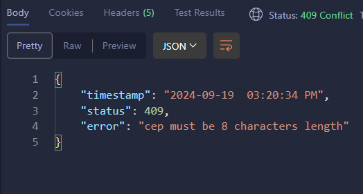

 <h1 align="center">
    Customizando nosso ResponseEntity<>
    
 </h1>

Todos as exceptions que acontecem em uma API externa, são `FeignExceptions`. Para tratar esses erros, vamos precisar usar o `try catch`.

<br>

O legal é que aqui também vamos usar a forma que ja conhecemos para tratar essas exceptions:

1. Vamos criar nossas proprias Classes filhas/extends de `RuntimeException`.

2. Criar uma class auxiliar, com todos os attributes da mensagem de erro, para passar no body da resposta http (ResponseEntity<>):
    - "**timestamp**":
    - "**status**":
    - "**error**": 
    - "**trace**"

3. Criar uma Class Global para customizar as nossas **RuntimeExceptions**. (`@ControllerAdvice` + `@ExceptionHandler`)

<hr>
<br>

## Praticando

💡 O ideal é realizar as validações locais antes de fazer chamadas a serviços externos.

<br>

As validacoes que vamos fazer são essas:

- Um cep possui apenas 8 digitos. Para menos ou para mais, sabemos que é um cep inexistente.
- Informour 8 digitos, porem cep nao existe.

<br>

✏️ Trate essas `FeignException`:

<hr>
<br>

### 1. Vamos criar nossas proprias Classes filhas/extends de `RuntimeException`.

```java
public class CepLengthIsWrongException extends RuntimeException{
    
    //constructors
    public CepLengthIsWrongException(){ //se nao quisermos preencher na hora de lancar
        super("cep must be 8 characters length");
    }

    public CepLengthIsWrongException(String errorMessage){ //preenchemos na hora de lancar a exception
        super(errorMessage);
    }
}

```

<hr>
<br>

### 2. Criar uma class auxiliar com todos os attributes da mensagem de erro:

```java
public class ErroPadrao {
    
    //attributes
    private LocalDateTime timestamp;
    private Integer status;
    private String error;

    //constructors
    public ErroPadrao(){}

    public ErroPadrao(LocalDateTime timestamp, Integer status, String error){
        this.timestamp = timestamp;
        this.status = status;
        this.error = error;
    }

    //getters and setters
    public String getTimestamp() {
        DateTimeFormatter dtf = DateTimeFormatter.ofPattern("yyyy-MM-dd  hh:mm:ss a"); // 2024-05-13  03:40:20 AM
        return dtf.format(this.timestamp);
    }

    public void setTimestamp(LocalDateTime timestamp) {
        this.timestamp = timestamp;
    }

    public Integer getStatus() {
        return status;
    }

    public void setStatus(Integer status) {
        this.status = status;
    }

    public String getError() {
        return error;
    }

    public void setError(String error) {
        this.error = error;
    }

    //NAO precisa do toString(). Os valores dos attributes são retornados no body da requisicao através dos getters()
}
```

<br>

💡 Importante lembrar que quando passamos um objeto no body da resposta HTTP (ResponseEntity<>), os valores dos attributes são os `getters()` desses attributes. Por isso, no attribute "timestamp" retornamos uma String formatadinha.

<hr>
<br>

### 3. Criar uma Class Global para customizar as nossas **RuntimeExceptions**. (`@ControllerAdvice` + `@ExceptionHandler`)


```java
@ControllerAdvice // class responsável em tratar as exceptions
public class GlobalExceptionHandler {
    
    // cep must be 8 characters length
    @ExceptionHandler(CepLengthIsWrongException.class) //sempre que acontecer essa exception, o method abaixo é executado
    public ResponseEntity<ErroPadrao> CepLengthIsWrongExceptionHandler(CepLengthIsWrongException e){
        
        ErroPadrao ep = new ErroPadrao();
        ep.setTimestamp(LocalDateTime.now());
        ep.setStatus(HttpStatus.CONFLICT.value());
        ep.setError(e.getMessage());

        return ResponseEntity
            .status(HttpStatus.CONFLICT) //estamos retornando uma resposta HTTP, e dentro do body enviamos um objeto.
            .body(ep);
    }
}
```

<br>

 💡 O ideal é fazer as validações antes de fazer chamadas a serviços externos.

<br>

Esse eh o resultado:

 