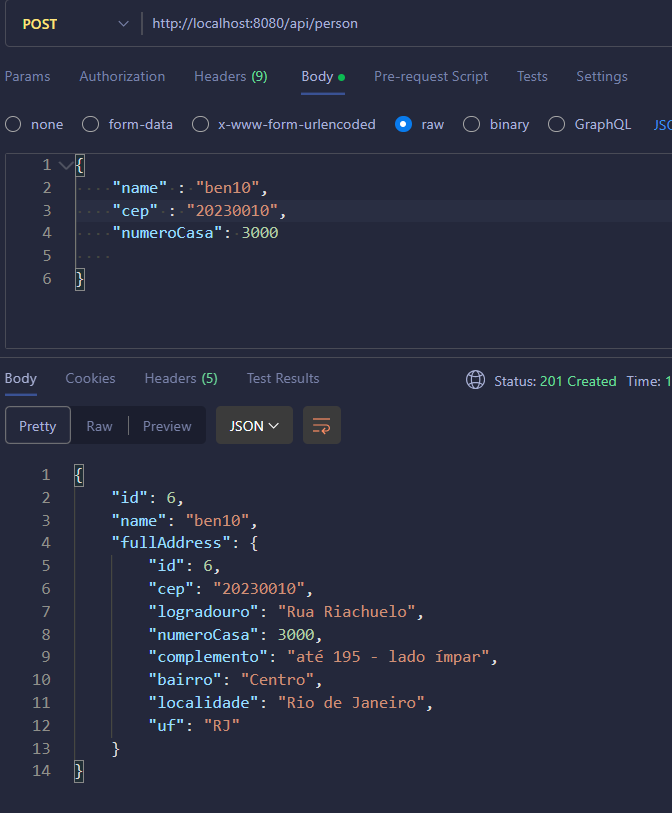

<h1 align="center">
    <span>Praticando</span>
    
</h1>

Ainda com a api externa do viacep, vamos fazer o seguinte exercicio:

Vamos trabalhar com 2 entitites, "Person" and "Address". O relacionamento dessas entities vai ser `@OneToOne`:

- 1 "person" pode ter apenas 1 "address"
- 1 "address" pode ser de apenas 1 "pessoa"

O objetivo aqui é apenas CADASTRAR uma pessoa, validando o CEP informado.

<hr>
<br>

## Criando um projeto do zero: 

Vá no [spring initializr](https://start.spring.io/) e crie um projeto do zero, com as seguintes dependencies:

- Spring Boot DevTools 
- JPA 
- Spring Web
- PostgreSQL Driver
- **OpenFeign** 

<hr>
<br>

## Configure o aplication.properties 

```properties
# definimos a porta que vamos usar do tomcat. Geralmente a porta padrao é 8080.
server.port=8080

# Informamos o caminho do banco de dados. A porta do banco é a porta 2222 local que conecta com a porta 5432 do container
spring.datasource.url=jdbc:postgresql://localhost:2222/db_relacionamentos

# Usuário do banco de dados
spring.datasource.username=postgres

# Senha do banco de dados. É a senha do usuario postgres
spring.datasource.password=123

# Acompanha as alterações feitas nas entidades. Qualquer alteração feita na entidade, a table também vai sofrer alteração.
spring.jpa.hibernate.ddl-auto=update

# Mostrar os commands SQL feitos pelo jpa
spring.jpa.show-sql=true
```

<hr>
<br>

## Criando as entities e as relacionando: 

### Person entity

Como é uma relação `@OneToOne`, podemos escolher em qual dos lados da relação queremos criar a column de ligação entre as entidades. Vamos adicionar essa column aqui na entidade "Person" mesmo.

<br>

| id  | name |address (objeto complexo)|
|:---:| :---:|:---:|

```java
@Entity //transformamos essa Class em uma table no banco
@Table(name = "tb_person") //setamos o nome da table
public class Person {
    
    //attributes
    @Id // PK
    @GeneratedValue(strategy = GenerationType.IDENTITY) //auto_increment
    @Column(name = "id") //setamos as info dessa column (constraints etc..)
    private Long id;

    @Column(name = "name", nullable = false, length = 100)
    private String name;

    @OneToOne(targetEntity = Address.class) //criamos a relacao.
    @JoinColumn(name = "address_id", nullable = false, unique = true) //criamos um campo nessa entidade. Esse campo deve ser unico. 1 pessoa nao pode ter o mesmo endereco de outra pessoa
    private Address fullAddress;

    //constructors
    public Person(){}

    //getters and setters
    public Long getId() {
        return id;
    }

    public void setId(Long id) {
        this.id = id;
    }

    public String getName() {
        return name;
    }

    public void setName(String name) {
        this.name = name;
    }

    public Address getFullAddress() {
        return fullAddress;
    }

    public void setFullAddress(Address fullAddress) {
        this.fullAddress = fullAddress;
    }  
}
```

<br>
<br>

### Address entity

Aqui, vamos apenas confirmar/mapear a relação.

<br>

| id  | cep| logradouro | number | complemento | bairro | localidade | uf |
|:---:|:---:|:---:|:---:|:---:|:---:|:---:|:---:|

```java
@Entity
@Table(name = "tb_address")
public class Address {
    
    //attributes
    @Id // PK
    @GeneratedValue(strategy = GenerationType.IDENTITY) //auto_increment
    @Column(name = "id") //setamos as info dessa column (constraints etc..)

    //Se quiser setar @Column nos outros attributes...
    private Long id;
    private String cep;
    private String logradouro;
    private Integer number;
    private String complemento;
    private String bairro;
    private String localidade;
    private String uf;

    @OneToOne(mappedBy = "fullAddress") //Se lá nós criamos a relação, aqui nós mapeamos/confirmamos essa relação.
    private Person owner;
    
    //constructors
    public Address(){}

    public Long getId() {
        return id;
    }

    //getters and setters
    public void setId(Long id) {
        this.id = id;
    }

    public String getCep() {
        return cep;
    }

    public void setCep(String cep) {
        this.cep = cep;
    }

    public String getLogradouro() {
        return logradouro;
    }

    public void setLogradouro(String logradouro) {
        this.logradouro = logradouro;
    }

    public Integer getNumber() {
        return number;
    }

    public void setNumber(Integer number) {
        this.number = number;
    }

    public String getComplemento() {
        return complemento;
    }

    public void setComplemento(String complemento) {
        this.complemento = complemento;
    }

    public String getBairro() {
        return bairro;
    }

    public void setBairro(String bairro) {
        this.bairro = bairro;
    }

    public String getLocalidade() {
        return localidade;
    }

    public void setLocalidade(String localidade) {
        this.localidade = localidade;
    }

    public String getUf() {
        return uf;
    }

    public void setUf(String uf) {
        this.uf = uf;
    } 
}
```

<br>

💡 Os valores dos attributes são retornados no body do ResponseEntity<> **através dos getters().**

<hr>
<br>

## Configurar o FeignClient 

O objetivo por enquanto eh verificar se o nosso FeignClient esta conseguindo mandar os requests para a aplicacao externa.

<br>

1. Habilite a conexao com APIs externas,  usando o `@EnableFeignClients` na Main Class da aplicacao.

<br>

2. Já criamos nossa Class "Address" para receber o objeto JSON. 

<br>

3. Criamos uma interface para simular um cliente. `@FeignClient`. É através de um objeto dessa interface que vamos fazer as nossas requisicoes para a API externa.

    <br>

    ```java
    //usaremos essa interface para representar a "controller class" da api externa
    @FeignClient(name = "viacep", url = "https://viacep.com.br/ws") //setamos a url/@requestMapping padrao
    public interface ViaCepController {
        

        // ====================== GET ======================
        @GetMapping("/{cep}/json")
        public Address getAddressByCep(@PathVariable("cep") String cep); //vamos informar esse cep, quando usarmos esse method
    }
    ```

    💡É aqui que vamos definir qual o tipo/Class do objeto JSON enviado pela api externa. Se ligou?? Nós que definimos qual vai ser a Class desse objeto.

<br>
<br>

4. Criamos uma controller simples, apenas para criar uma rota e testar o request para a API externa:

    <br>

    ```java
    @RestController
    @RequestMapping("/api")
    public class PersonController {


        //attributes
        private ViaCepController viaCepController;

        //constructors
        public PersonController(ViaCepController viaCepController){
            this.viaCepController = viaCepController;
        }
        
        // ============= GET =============
        @GetMapping("/{cep}")
        public ResponseEntity<Address> getAddressById(@PathVariable("cep") String cep){
            return ResponseEntity
                .status(HttpStatus.OK)
                .body(this.viaCepController.getAddressByCep(cep));
        }
    }
    ```

Beleza! Conseguimos fazer requests para a API externa 😎. Agora vamos pro CRUD.

<hr>
<br>

## Criando a Controller Class

Nesse exercício vamos apenas trabalhar com o **CREATE**. A ideia aqui é apenas entender como que uma aplicacao local conversa com uma aplicacao externa. Vamos deixar para fazer o CRUD completo nos nossos projetos de portfolio.

Aqui, vamos criar 2 rotas:

- Rota para criar uma pessoa
- Rota para listar todas as pessoas

<br>

```java
@RestController
@RequestMapping("/api/person")
public class PersonController {

    //attributes
    private PersonService ps;

    //constructors
    public PersonController(PersonService ps){
        this.ps = ps;
    }

    // ====================== POST ======================
    @PostMapping("")
    public ResponseEntity<PersonFullDto> getAddressByCep(@RequestBody PersonCreateDto personCreateDto){
        return ResponseEntity
            .status(HttpStatus.CREATED)
            .body(this.ps.createPerson(personCreateDto));
    }


    // ====================== GET ======================
    @GetMapping("/{cep}")
    public ResponseEntity<Address> getAddressByCep(@PathVariable("cep") String cep){
        return ResponseEntity
            .status(HttpStatus.OK)
            .body(this.ps.getAddressByCep(cep));
    }  
}
```

<hr>
<br>

## Criando uma Class para nossas validacoes:

Vamos fazer as seguintes validacoes:

- O campo "name" e "cep" não podem ser NULL.

<br>

- Um cep possui exatamente 8 dígitos. Nem mais, nem menos.

<br>

- O cep só estará correto, se tiver apenas numbers. Não pode ter letras. Para isso, criamos um method para percorrer todas as letras de uma String. Tentamos transformar cada letra dessa String em um Integer Se retornar true, quer dizer que todas as letrar conseguiram ser convertidas para Integer.

<br>

- Verificamos se o cep existe. Pra isso, só consultar o campo "bairro", ou qualquer outro campo, e verificar se ele não é null.

<br>

- Remover o '-' do attribute cep. O attribute 'cep', do objeto JSON, vem acompanhado de '-'. Nao queremos isso. Queremos apenas numbers.

<br>

```java
package br.com.lGabrielDev.praticandinho.person.validations;

import br.com.lGabrielDev.praticandinho.address.Address;
import br.com.lGabrielDev.praticandinho.external.ViaCepController;

public abstract class PersonValidations {
    
    // O campo "name" e o campo "cep" não podem ser NULL
    public static Boolean nameAndCepAreNotNull(String name, String cep){
        String errorMessage = "";

        if(name == null || cep == null){
            if(name == null){
                errorMessage = "'Name' cannot be null!";
            }
            else{
                errorMessage = "cep cannot be null!";
            }
            throw new RuntimeException(errorMessage);
        }
        return true;
    }


    // Um cep possui exatamente 8 dígitos. Nem mais, nem menos.
    public static Boolean cepLengthIs8(String cep){
        if(cep.length() != 8){
            throw new RuntimeException("Cep length must be 8. Not more, not less.");
        }
        return true;
    }


    // O cep só estará correto, se tiver apenas numbers. Não pode ter letras.
    // Para isso, criamos um method para percorrer todas as letras de uma String.
    // Tentamos transformar cada letra dessa String em um Integer Se retornar true, quer dizer que todas as letrar conseguiram ser convertidas para Integer.
    public static Boolean cepOnlyHasNumbers(String cep){
        cep.chars().forEach((c) ->{
            if(!(Character.isDigit(c))){ //method static criado pelo proprio Java, na class Character. Se não for digito (1,2,3....) lancamos a exception
                throw new RuntimeException("CEP deve conter apenas numbers");
            }
        });
        return true;
    }


    //verificamos se o cep existe. Pra isso, só consultar o campo "bairro", ou qualquer outro campo, e verificar se ele não é null
    public static Boolean cepExiste(String cep, ViaCepController viaCepController){
        Address addressCru = viaCepController.getAddressByCep(cep);
        String bairro = addressCru.getBairro();

        if(bairro == null){
            throw new RuntimeException("Cep não existe!");
        }
        return true;
    }

    
    //vamos remover o '-' do attribute cep. O attribute 'cep', do objeto JSON, vem acompanhado de '-'. Nao queremos isso. Queremos apenas numbers.
    public static String removerTraco(String cep){
        return cep.replace("-", "");
    }
}
```

<hr>
<br>

## Service

```java
@Service
public class PersonService {

    //attributes
    private ViaCepController viaCepController;
    private AddressRepository ar;
    private PersonRepository pr;
    

    //constructors
    public PersonService(ViaCepController viaCepController, AddressRepository ar, PersonRepository pr){
        this.viaCepController = viaCepController;
        this.ar = ar;
        this.pr = pr;
    }

    // ====================== POST ======================
    public PersonFullDto createPerson(PersonCreateDto personCreateDto){

        //validations...
        PersonValidations.nameAndCepAreNotNull(personCreateDto.getName(), personCreateDto.getCep());
        PersonValidations.cepLengthIs8(personCreateDto.getCep());
        PersonValidations.cepOnlyHasNumbers(personCreateDto.getCep());

        //verificamos se o cep existe. Pra isso, só consultar o campo "bairro", ou qualquer outro campo, e verificar se ele não é null
        PersonValidations.cepExiste(personCreateDto.getCep(), this.viaCepController);

        //setamos o endereco
        Address addressCru = this.viaCepController.getAddressByCep(personCreateDto.getCep()); //esse "Address" recebe o objeto da API externa
        addressCru.setNumber(personCreateDto.getNumeroCasa()); //setamos o numero da casa
        addressCru.setCep(PersonValidations.removerTraco(addressCru.getCep())); //Antes de salvar no banco, vamos remover o '-' do attribute cep. O attribute 'cep', do objeto JSON, vem acompanhado de '-'. Nao queremos isso. Queremos apenas numbers.

        //antes de tudo, precisamos salvar no banco o "endereco". Lembrando que ele nao pode ter vinculo nenhum com a outra entidade. Vamos fazer a bilateralidade depois. Vamos salvar o "address" primeiro, porque ele possui apenas attributes sem vinculo com outra entidade.
        this.ar.save(addressCru);

        //Com o "address" no banco, agora sim podemos criar nosso "person" e salvar no banco
        Person personCru = new Person(personCreateDto, addressCru);

        //bilateralidade
        addressCru.setOwner(personCru);
        personCru.setFullAddress(addressCru);

        //salvamos a "person" no banco, contendo o "address"
        this.pr.save(personCru);
        return new PersonFullDto(personCru);
    }


    // ====================== GET ======================
    public Address getAddressByCep(String cep){
        return this.viaCepController.getAddressByCep(cep);
    }
}
```

<br>

## Resultado:



*endereco ficticio*

<br>

Obviamente, nós precisamos criar as Repository, criar as DTOs, tratar as Exceptions, etc... Padraozinho. Denovo, esse exercicio foi só para entender como funciona uma API local conversando com uma aplicacao externa.

<br>

❗  O HttpSatus **NO_CONTENT** NÃO possui body. Entao, use qualquer outro HttpStatus.

<br>

📖 Sempre faca as validacoes antes de fazer as solicitacoes para a aplicacao externa. Fica mais fácil de tratar as Exceptions assim.