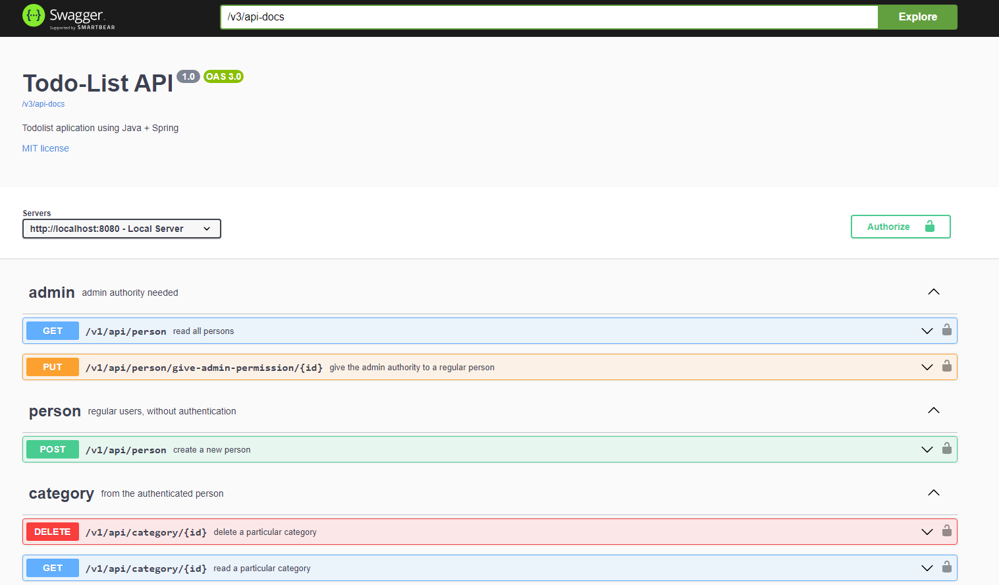

<h1 align="center">
    <span>Swagger</span>
    
</h1>

O Swagger é uma ferramenta utilizada para documentar nossas APIs, permitindo padronizar a maneira como explicamos nossos endpoints para outros desenvolvedores.

Para documentar nossa spring API é bem simples. Basta seguirmos esses passos:

<hr>
<br>

## 1. Colocar a dependencie da [SpringDoc OpenAPI Starter WebMVC UI](https://mvnrepository.com/artifact/org.springdoc/springdoc-openapi-starter-webmvc-ui):


```xml
<dependency>
    <groupId>org.springdoc</groupId>
    <artifactId>springdoc-openapi-starter-webmvc-ui</artifactId>
    <version>2.3.0</version>
</dependency>
```
    
<br>

Quando colocamos essa dependencie na nossa aplicacao, automaticamente já recebemos uma pagina HTML do swagger. Para acessar essa pagina, acessamos a seguinte URI:

`http://localhost:8080/swagger-ui/index.html`

<hr>
<br>

## 2. Criamos nossas @Operations

Vamos nas nossas Controllers e criar uma `@Operation` para cada endpoint desse Controller.

💡 Para criar as tags(categorias/abas), crie no próprio Controller. Assim, todas as rotas desse Controller estarão no mesmo grupo.

<br>

```java
@RestController
@RequestMapping("/api")
@Tag(name = "controller1", description = "rotas da controller 1") //criamos uma categoria/aba para as rotas dessa Controller. Todas as rotas estarão no mesmo "grupo" lá no swagger
public class PersonController1 {
    

    //rota 1
    @Operation(description = "retorna uma pessoa insana 1") //configuramos esse endpoint lá no swagger
    @ApiResponses( value = { //criamos as possiveis responses
            @ApiResponse(responseCode = "200 OK", description = "retorna uma pessoa insana com sucesso"),
            @ApiResponse(responseCode = "400 Bad Request", description = "fez algo errado")
        }
    )
    @GetMapping("/rota1")
    public ResponseEntity<Person> rota1(){
        
        Person p1 = new PersonBuilder() //padrao de projeto builder =D
            .setName("goku")
            .setAge(44)
            .build(); 

        return ResponseEntity
            .status(HttpStatus.OK)
            .body(p1);
    }


    //rota 2
    @Operation(description = "retorna uma pessoa insana 2") //configuramos esse endpoint lá no swagger
    @ApiResponses( value = { //criamos as possiveis responses
            @ApiResponse(responseCode = "200 OK", description = "retorna uma pessoa insana com sucesso"),
            @ApiResponse(responseCode = "400 Bad Request", description = "fez algo errado")
        }
    )
    @GetMapping("/rota2")
    public ResponseEntity<Person> rota2(){
        
        Person p1 = new PersonBuilder() //padrao de projeto builder =D
            .setName("goku")
            .setAge(44)
            .build(); 

        return ResponseEntity
            .status(HttpStatus.OK)
            .body(p1);
    }
}
```

<br>

📖 Para adicionar uma tag/categoria a todos os endpoints de um Controlador, basta usar a anotação `@Tag` no próprio Controller. Isso aplica automaticamente a tag a todos os endpoints desse controlador.

<br>

Beleza, todos os endpoints foram configurados. Agora, precisamos setar as outras informacoes do swagger:

- nome da API
- versao
- licensa
- descricao
- etc...

<hr>
<br>

## 3. Criando nossa Class de @Configuration

Aqui, vamos criar um `@Bean` para criar um objeto **OpenApi**.

Sempre que for solicitado um objeto OpenApi, o spring utilizará esse objeto

```java

import io.swagger.v3.oas.models.OpenAPI;
import io.swagger.v3.oas.models.info.Contact;
import io.swagger.v3.oas.models.info.Info;
import io.swagger.v3.oas.models.info.License;
import io.swagger.v3.oas.models.servers.Server;

@Configuration //Indica ao Spring que a classe contém definições de beans.
public class SwaggerConfiguration {
    
    @Bean
    public OpenAPI setandoConfig(){
        return new OpenAPI()
            .info(
                new Info().title("API TAL TAL").description("informacoes tal tal tal")
                    .license(
                        new License().name("MIT").url("http://taltaltal.com.br")
                    )
                    .contact(
                        new Contact().email("taltal@gmail.com").name("gabriel")
                    )
                    .version("50.4")
            )
            .servers(
                List.of(
                    new Server().url("http://localhost:8080")
                    .description("servidor insano")
                )
            );
            //tags.... etc....
    }
}
```

<br>

⚠️ A classe de configuração deve estar no mesmo pacote que a classe principal da aplicação ou em uma subpasta desse pacote. Isso garante que o Spring consiga escanear e registrar a configuração corretamente.

<br>

Depois de tudo setadinho, você terá algo parecido com isso:

`http://localhost:8080/swagger-ui/index.html`



Pronto. Documentamos nossa API 😎

<hr>
<br>

## O que é um Bean?

Bean é um método que é executado sempre que iniciamos nossa aplicação Spring. Geralmente, são métodos que retornam algum objeto. Assim, quando a aplicação Spring é iniciada, ela instancia automaticamente esse objeto.

Quando o Spring achar que deve utilizar esse objeto, ele o fará.

<br>
<br>

## Entendendo o fluxo do @Bean que criamos

1. Criamos um `@Bean` para um objeto, neste caso, um objeto **OpenAPI**. Quando a aplicação Spring iniciar, esse objeto será automaticamente instanciado.

<br>

2. Quando acessamos `http://localhost:8080/swagger-ui/index.html`, estamos solicitando a interface do Swagger.

<br>

3. O Spring verifica que precisa do objeto **OpenAPI**. Como já foi criado anteriormente com o `@Bean`, ele utiliza esse objeto.

<br>

4. O objeto OpenAPI que foi instanciado é retornado para ser usado na interface do Swagger, permitindo que a documentação da API seja exibida corretamente.